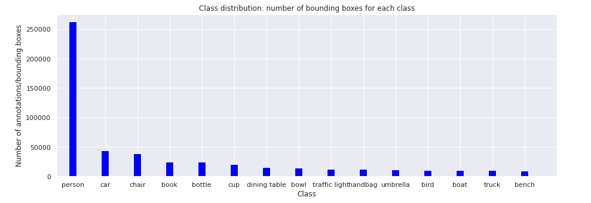
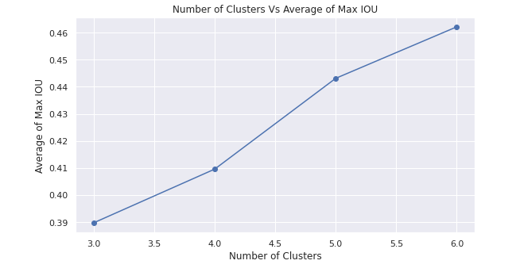
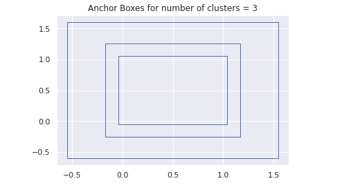
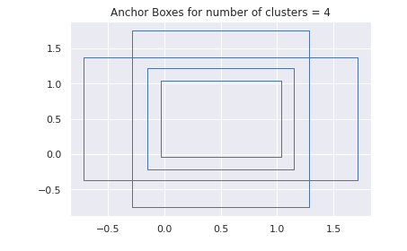
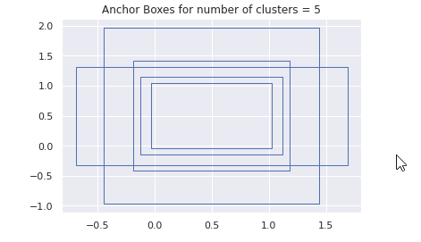
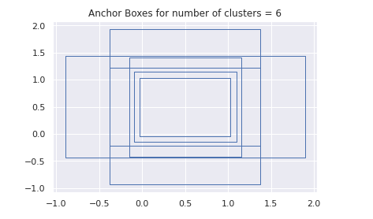

- [1. Team Members](#1-team-members)
- [2. Problem Statement](#2-problem-statement)
- [3. Class distribution (along with the class names) along with a graph](#3-class-distribution-along-with-the-class-names-along-with-a-graph)
  - [3.1. Show all classes in the dataset: class ID to class name mapping](#31-show-all-classes-in-the-dataset-class-id-to-class-name-mapping)
  - [3.2. Class distribution for the top 15 classes (class vs number of bounding boxes)](#32-class-distribution-for-the-top-15-classes-class-vs-number-of-bounding-boxes)
  - [3.3. Plot of "number of clusters" for KMeans vs the "average of max of IOUs"](#33-plot-of-number-of-clusters-for-kmeans-vs-the-average-of-max-of-ious)
- [4. Calculate the Anchor Boxes for k = 3, 4, 5, 6 and draw them](#4-calculate-the-anchor-boxes-for-k--3-4-5-6-and-draw-them)
  - [4.1. Anchor boxes for num of clusters = 3](#41-anchor-boxes-for-num-of-clusters--3)
  - [4.2. Anchor boxes for num of clusters = 4](#42-anchor-boxes-for-num-of-clusters--4)
  - [4.3. Anchor boxes for num of clusters = 5](#43-anchor-boxes-for-num-of-clusters--5)
  - [4.4. Anchor boxes for num of clusters = 6](#44-anchor-boxes-for-num-of-clusters--6)
## 1. Team Members

- Haswanth Aekula
- Raja Rajendran
- Shreeyash Pawar

## 2. Problem Statement
- Download COCO dataset and learn how COCO object detection dataset's schema is.
- Identify following things for this dataset:
  - Class distribution (along with the class names) along with a graph
  - Calculate the Anchor Boxes for k = 3, 4, 5, 6 and draw them.

## 3. Class distribution (along with the class names) along with a graph

### 3.1. Show all classes in the dataset: class ID to class name mapping

from <https://github.com/hassiahk/EVA6-Phase1-Assignments/blob/main/Session10-Object_Localization/COCO_K-Means/session_10_part_b_anchor_boxes_computation_for_coco_dataset.ipynb>

```
id=1	name=person		supercategory=person
id=2	name=bicycle		supercategory=vehicle
id=3	name=car		supercategory=vehicle
id=4	name=motorcycle		supercategory=vehicle
id=5	name=airplane		supercategory=vehicle
id=6	name=bus		supercategory=vehicle
id=7	name=train		supercategory=vehicle
id=8	name=truck		supercategory=vehicle
id=9	name=boat		supercategory=vehicle
id=10	name=traffic light		supercategory=outdoor
id=11	name=fire hydrant		supercategory=outdoor
id=13	name=stop sign		supercategory=outdoor
id=14	name=parking meter		supercategory=outdoor
id=15	name=bench		supercategory=outdoor
id=16	name=bird		supercategory=animal
id=17	name=cat		supercategory=animal
id=18	name=dog		supercategory=animal
id=19	name=horse		supercategory=animal
id=20	name=sheep		supercategory=animal
id=21	name=cow		supercategory=animal
id=22	name=elephant		supercategory=animal
id=23	name=bear		supercategory=animal
id=24	name=zebra		supercategory=animal
id=25	name=giraffe		supercategory=animal
id=27	name=backpack		supercategory=accessory
id=28	name=umbrella		supercategory=accessory
id=31	name=handbag		supercategory=accessory
id=32	name=tie		supercategory=accessory
id=33	name=suitcase		supercategory=accessory
id=34	name=frisbee		supercategory=sports
id=35	name=skis		supercategory=sports
id=36	name=snowboard		supercategory=sports
id=37	name=sports ball		supercategory=sports
id=38	name=kite		supercategory=sports
id=39	name=baseball bat		supercategory=sports
id=40	name=baseball glove		supercategory=sports
id=41	name=skateboard		supercategory=sports
id=42	name=surfboard		supercategory=sports
id=43	name=tennis racket		supercategory=sports
id=44	name=bottle		supercategory=kitchen
id=46	name=wine glass		supercategory=kitchen
id=47	name=cup		supercategory=kitchen
id=48	name=fork		supercategory=kitchen
id=49	name=knife		supercategory=kitchen
id=50	name=spoon		supercategory=kitchen
id=51	name=bowl		supercategory=kitchen
id=52	name=banana		supercategory=food
id=53	name=apple		supercategory=food
id=54	name=sandwich		supercategory=food
id=55	name=orange		supercategory=food
id=56	name=broccoli		supercategory=food
id=57	name=carrot		supercategory=food
id=58	name=hot dog		supercategory=food
id=59	name=pizza		supercategory=food
id=60	name=donut		supercategory=food
id=61	name=cake		supercategory=food
id=62	name=chair		supercategory=furniture
id=63	name=couch		supercategory=furniture
id=64	name=potted plant		supercategory=furniture
id=65	name=bed		supercategory=furniture
id=67	name=dining table		supercategory=furniture
id=70	name=toilet		supercategory=furniture
id=72	name=tv		supercategory=electronic
id=73	name=laptop		supercategory=electronic
id=74	name=mouse		supercategory=electronic
id=75	name=remote		supercategory=electronic
id=76	name=keyboard		supercategory=electronic
id=77	name=cell phone		supercategory=electronic
id=78	name=microwave		supercategory=appliance
id=79	name=oven		supercategory=appliance
id=80	name=toaster		supercategory=appliance
id=81	name=sink		supercategory=appliance
id=82	name=refrigerator		supercategory=appliance
id=84	name=book		supercategory=indoor
id=85	name=clock		supercategory=indoor
id=86	name=vase		supercategory=indoor
id=87	name=scissors		supercategory=indoor
id=88	name=teddy bear		supercategory=indoor
id=89	name=hair drier		supercategory=indoor
id=90	name=toothbrush		supercategory=indoor
```

### 3.2. Class distribution for the top 15 classes (class vs number of bounding boxes)

from <https://github.com/hassiahk/EVA6-Phase1-Assignments/blob/main/Session10-Object_Localization/COCO_K-Means/session_10_part_b_anchor_boxes_computation_for_coco_dataset.ipynb>



### 3.3. Plot of "number of clusters" for KMeans vs the "average of max of IOUs"

from <https://github.com/hassiahk/EVA6-Phase1-Assignments/blob/main/Session10-Object_Localization/COCO_K-Means/session_10_part_b_anchor_boxes_computation_for_coco_dataset.ipynb>

the average IOU will converge to one as the number of clusters (`K`) becomes equal to the number of bounding boxes.. But usually far smaller value of `K` is used.. YOLO uses `k=5` (number of anchor boxes == 5)..

  

## 4. Calculate the Anchor Boxes for k = 3, 4, 5, 6 and draw them

from <https://github.com/hassiahk/EVA6-Phase1-Assignments/blob/main/Session10-Object_Localization/COCO_K-Means/session_10_part_b_anchor_boxes_computation_for_coco_dataset.ipynb>
### 4.1. Anchor boxes for num of clusters = 3

from <https://github.com/hassiahk/EVA6-Phase1-Assignments/blob/main/Session10-Object_Localization/COCO_K-Means/session_10_part_b_anchor_boxes_computation_for_coco_dataset.ipynb>

  

### 4.2. Anchor boxes for num of clusters = 4

from <https://github.com/hassiahk/EVA6-Phase1-Assignments/blob/main/Session10-Object_Localization/COCO_K-Means/session_10_part_b_anchor_boxes_computation_for_coco_dataset.ipynb>

  

### 4.3. Anchor boxes for num of clusters = 5

from <https://github.com/hassiahk/EVA6-Phase1-Assignments/blob/main/Session10-Object_Localization/COCO_K-Means/session_10_part_b_anchor_boxes_computation_for_coco_dataset.ipynb>

  

### 4.4. Anchor boxes for num of clusters = 6

from <https://github.com/hassiahk/EVA6-Phase1-Assignments/blob/main/Session10-Object_Localization/COCO_K-Means/session_10_part_b_anchor_boxes_computation_for_coco_dataset.ipynb>

  

