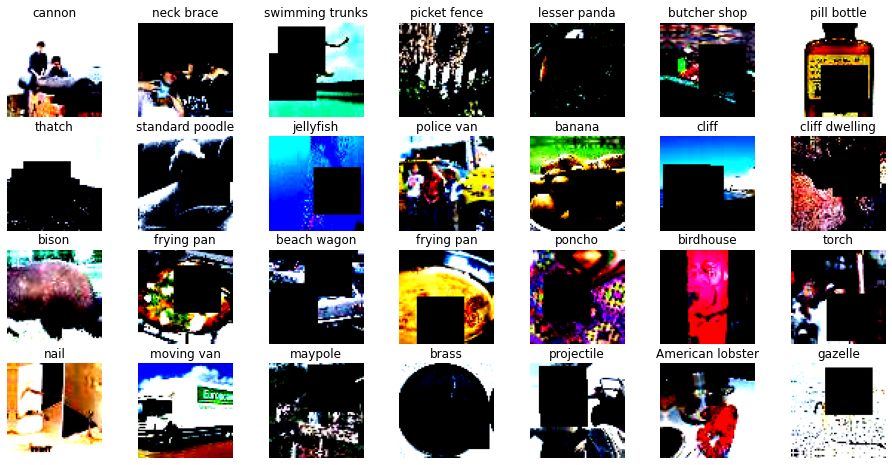
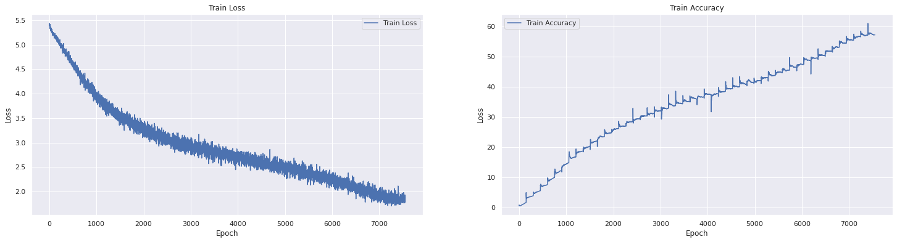
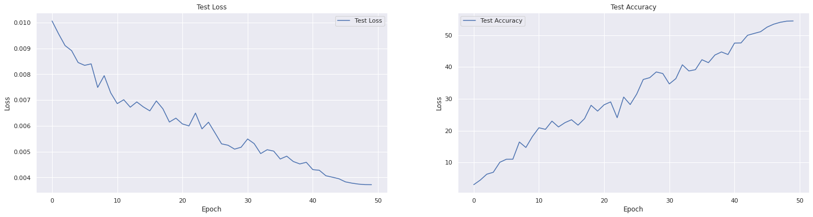
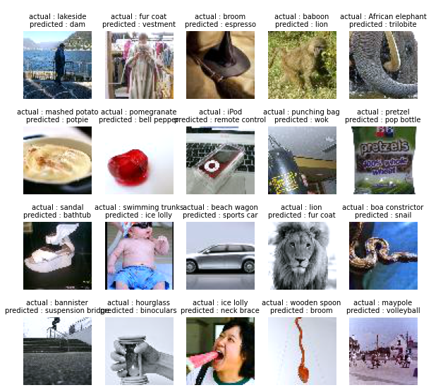
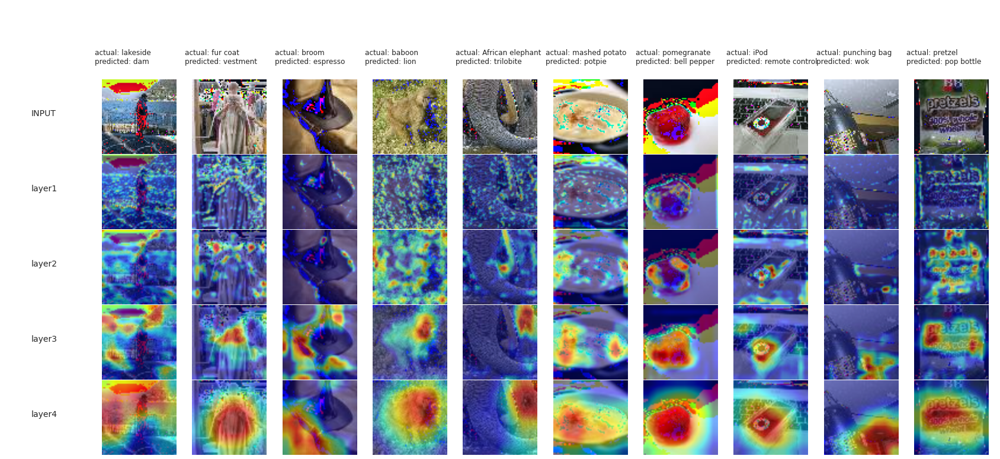

# Problem Statement
Train ResNet18 on [Tiny ImageNet](http://cs231n.stanford.edu/tiny-imagenet-200.zip) with 70/30 split for 50 Epochs. The target is to achieve 50%+ validation accuracy.

## Augmented Tiny ImageNet Dataset


### Some Details about Tiny ImageNet
- Train set - 100000 images
- Valid set - 10000 images
- No. of classes - 200
- Mean (RGB) - (0.4802, 0.4481, 0.3975)
- Standard Deviation (RGB) - (0.2302, 0.2265, 0.2262)

## Modularized GIT Repository
Modularized GIT repository for training vision models in PyTorch: [train-your-model-pytorch](https://github.com/hassiahk/train-your-model-pytorch)

### Folder Structure
```bash
.
├── main.py
├── models
│   ├── custom_resnet.py
│   ├── __init__.py
│   └── resnet.py
    └── resnet18.py
├── README.md
├── requirements.txt
└── utils
    ├── dataset.py
    ├── grad_cam.py
    ├── helper.py
    ├── lr_finder.py
    ├── __init__.py
    ├── plot_utils.py
    ├── test.py
    ├── train.py
    └── transforms.py
```

## Training Details
We achieved a `validation accuracy` of `54.45%` and a `train accuracy` of `57.12%` in the `50th epoch`. The final notebook is [here](ResNet18_Tiny_ImageNet_Experiment2.ipynb).
- Epochs - 50
- Data Augmentation
  - RandomCrop(64, padding=4)
  - HorizontalFlip
  - Rotate(+-5)
  - Cutout(32x32, max_holes=2)
- Learning Rate - 0.01
- Optimizer - SGD
- Loss - CrossEntropyLoss

## Model Summary
```bash
----------------------------------------------------------------
        Layer (type)               Output Shape         Param #
================================================================
            Conv2d-1           [-1, 64, 64, 64]           1,728
       BatchNorm2d-2           [-1, 64, 64, 64]             128
            Conv2d-3           [-1, 64, 64, 64]          36,864
       BatchNorm2d-4           [-1, 64, 64, 64]             128
            Conv2d-5           [-1, 64, 64, 64]          36,864
       BatchNorm2d-6           [-1, 64, 64, 64]             128
        BasicBlock-7           [-1, 64, 64, 64]               0
            Conv2d-8           [-1, 64, 64, 64]          36,864
       BatchNorm2d-9           [-1, 64, 64, 64]             128
           Conv2d-10           [-1, 64, 64, 64]          36,864
      BatchNorm2d-11           [-1, 64, 64, 64]             128
       BasicBlock-12           [-1, 64, 64, 64]               0
           Conv2d-13          [-1, 128, 32, 32]          73,728
      BatchNorm2d-14          [-1, 128, 32, 32]             256
           Conv2d-15          [-1, 128, 32, 32]         147,456
      BatchNorm2d-16          [-1, 128, 32, 32]             256
           Conv2d-17          [-1, 128, 32, 32]           8,192
      BatchNorm2d-18          [-1, 128, 32, 32]             256
       BasicBlock-19          [-1, 128, 32, 32]               0
           Conv2d-20          [-1, 128, 32, 32]         147,456
      BatchNorm2d-21          [-1, 128, 32, 32]             256
           Conv2d-22          [-1, 128, 32, 32]         147,456
      BatchNorm2d-23          [-1, 128, 32, 32]             256
       BasicBlock-24          [-1, 128, 32, 32]               0
           Conv2d-25          [-1, 256, 16, 16]         294,912
      BatchNorm2d-26          [-1, 256, 16, 16]             512
           Conv2d-27          [-1, 256, 16, 16]         589,824
      BatchNorm2d-28          [-1, 256, 16, 16]             512
           Conv2d-29          [-1, 256, 16, 16]          32,768
      BatchNorm2d-30          [-1, 256, 16, 16]             512
       BasicBlock-31          [-1, 256, 16, 16]               0
           Conv2d-32          [-1, 256, 16, 16]         589,824
      BatchNorm2d-33          [-1, 256, 16, 16]             512
           Conv2d-34          [-1, 256, 16, 16]         589,824
      BatchNorm2d-35          [-1, 256, 16, 16]             512
       BasicBlock-36          [-1, 256, 16, 16]               0
           Conv2d-37            [-1, 512, 8, 8]       1,179,648
      BatchNorm2d-38            [-1, 512, 8, 8]           1,024
           Conv2d-39            [-1, 512, 8, 8]       2,359,296
      BatchNorm2d-40            [-1, 512, 8, 8]           1,024
           Conv2d-41            [-1, 512, 8, 8]         131,072
      BatchNorm2d-42            [-1, 512, 8, 8]           1,024
       BasicBlock-43            [-1, 512, 8, 8]               0
           Conv2d-44            [-1, 512, 8, 8]       2,359,296
      BatchNorm2d-45            [-1, 512, 8, 8]           1,024
           Conv2d-46            [-1, 512, 8, 8]       2,359,296
      BatchNorm2d-47            [-1, 512, 8, 8]           1,024
       BasicBlock-48            [-1, 512, 8, 8]               0
           Linear-49                  [-1, 200]         102,600
================================================================
Total params: 11,271,432
Trainable params: 11,271,432
Non-trainable params: 0
----------------------------------------------------------------
Input size (MB): 0.05
Forward/backward pass size (MB): 45.00
Params size (MB): 43.00
Estimated Total Size (MB): 88.05
----------------------------------------------------------------
```

## Traning Logs
```bash
  0%|          | 0/151 [00:00<?, ?it/s]Epoch 1:
Train Loss=5.168421745300293 Batch_id=150 LR= 0.00050 Train Accuracy= 1.59: 100%|██████████| 151/151 [01:37<00:00,  1.55it/s]
  0%|          | 0/151 [00:00<?, ?it/s]
: Average Test loss: 0.0101, Test Accuracy: 1008/33000 (3.05%)

Epoch 2:
Train Loss=5.024040222167969 Batch_id=150 LR= 0.00082 Train Accuracy= 3.81: 100%|██████████| 151/151 [01:37<00:00,  1.55it/s]
  0%|          | 0/151 [00:00<?, ?it/s]
: Average Test loss: 0.0096, Test Accuracy: 1483/33000 (4.49%)

Epoch 3:
Train Loss=4.657078742980957 Batch_id=150 LR= 0.00132 Train Accuracy= 5.51: 100%|██████████| 151/151 [01:37<00:00,  1.55it/s]
  0%|          | 0/151 [00:00<?, ?it/s]
: Average Test loss: 0.0091, Test Accuracy: 2093/33000 (6.34%)

Epoch 4:
Train Loss=4.530813217163086 Batch_id=150 LR= 0.00199 Train Accuracy= 7.54: 100%|██████████| 151/151 [01:37<00:00,  1.55it/s]
  0%|          | 0/151 [00:00<?, ?it/s]
: Average Test loss: 0.0089, Test Accuracy: 2293/33000 (6.95%)

Epoch 5:
Train Loss=4.419885158538818 Batch_id=150 LR= 0.00280 Train Accuracy= 9.87: 100%|██████████| 151/151 [01:37<00:00,  1.55it/s]
  0%|          | 0/151 [00:00<?, ?it/s]
: Average Test loss: 0.0085, Test Accuracy: 3326/33000 (10.08%)

Epoch 6:
Train Loss=4.045364856719971 Batch_id=150 LR= 0.00372 Train Accuracy= 12.16: 100%|██████████| 151/151 [01:37<00:00,  1.55it/s]
  0%|          | 0/151 [00:00<?, ?it/s]
: Average Test loss: 0.0083, Test Accuracy: 3642/33000 (11.04%)

Epoch 7:
Train Loss=3.9006879329681396 Batch_id=150 LR= 0.00470 Train Accuracy= 14.77: 100%|██████████| 151/151 [01:37<00:00,  1.55it/s]
  0%|          | 0/151 [00:00<?, ?it/s]
: Average Test loss: 0.0084, Test Accuracy: 3647/33000 (11.05%)

Epoch 8:
Train Loss=3.6800971031188965 Batch_id=150 LR= 0.00571 Train Accuracy= 16.69: 100%|██████████| 151/151 [01:37<00:00,  1.56it/s]
  0%|          | 0/151 [00:00<?, ?it/s]
: Average Test loss: 0.0075, Test Accuracy: 5429/33000 (16.45%)

Epoch 9:
Train Loss=3.694608688354492 Batch_id=150 LR= 0.00669 Train Accuracy= 18.59: 100%|██████████| 151/151 [01:37<00:00,  1.55it/s]
  0%|          | 0/151 [00:00<?, ?it/s]
: Average Test loss: 0.0079, Test Accuracy: 4863/33000 (14.74%)

Epoch 10:
Train Loss=3.51838755607605 Batch_id=150 LR= 0.00760 Train Accuracy= 20.28: 100%|██████████| 151/151 [01:37<00:00,  1.55it/s]
  0%|          | 0/151 [00:00<?, ?it/s]
: Average Test loss: 0.0073, Test Accuracy: 5997/33000 (18.17%)

Epoch 11:
Train Loss=3.537307024002075 Batch_id=150 LR= 0.00842 Train Accuracy= 21.86: 100%|██████████| 151/151 [01:37<00:00,  1.55it/s]
  0%|          | 0/151 [00:00<?, ?it/s]
: Average Test loss: 0.0069, Test Accuracy: 6904/33000 (20.92%)

Epoch 12:
Train Loss=3.3098461627960205 Batch_id=150 LR= 0.00909 Train Accuracy= 23.47: 100%|██████████| 151/151 [01:37<00:00,  1.56it/s]
  0%|          | 0/151 [00:00<?, ?it/s]
: Average Test loss: 0.0070, Test Accuracy: 6741/33000 (20.43%)

Epoch 13:
Train Loss=3.3105194568634033 Batch_id=150 LR= 0.00959 Train Accuracy= 24.69: 100%|██████████| 151/151 [01:37<00:00,  1.55it/s]
  0%|          | 0/151 [00:00<?, ?it/s]
: Average Test loss: 0.0067, Test Accuracy: 7592/33000 (23.01%)

Epoch 14:
Train Loss=3.1745591163635254 Batch_id=150 LR= 0.00990 Train Accuracy= 26.10: 100%|██████████| 151/151 [01:37<00:00,  1.56it/s]
  0%|          | 0/151 [00:00<?, ?it/s]
: Average Test loss: 0.0069, Test Accuracy: 6990/33000 (21.18%)

Epoch 15:
Train Loss=3.2141876220703125 Batch_id=150 LR= 0.01000 Train Accuracy= 27.00: 100%|██████████| 151/151 [01:37<00:00,  1.55it/s]
  0%|          | 0/151 [00:00<?, ?it/s]
: Average Test loss: 0.0067, Test Accuracy: 7436/33000 (22.53%)

Epoch 16:
Train Loss=3.1967389583587646 Batch_id=150 LR= 0.00998 Train Accuracy= 28.38: 100%|██████████| 151/151 [01:37<00:00,  1.56it/s]
  0%|          | 0/151 [00:00<?, ?it/s]
: Average Test loss: 0.0066, Test Accuracy: 7734/33000 (23.44%)

Epoch 17:
Train Loss=3.0244829654693604 Batch_id=150 LR= 0.00992 Train Accuracy= 29.42: 100%|██████████| 151/151 [01:36<00:00,  1.56it/s]
  0%|          | 0/151 [00:00<?, ?it/s]
: Average Test loss: 0.0070, Test Accuracy: 7176/33000 (21.75%)

Epoch 18:
Train Loss=2.8824868202209473 Batch_id=150 LR= 0.00982 Train Accuracy= 30.24: 100%|██████████| 151/151 [01:37<00:00,  1.55it/s]
  0%|          | 0/151 [00:00<?, ?it/s]
: Average Test loss: 0.0067, Test Accuracy: 7851/33000 (23.79%)

Epoch 19:
Train Loss=3.142005681991577 Batch_id=150 LR= 0.00968 Train Accuracy= 31.12: 100%|██████████| 151/151 [01:37<00:00,  1.56it/s]
  0%|          | 0/151 [00:00<?, ?it/s]
: Average Test loss: 0.0061, Test Accuracy: 9232/33000 (27.98%)

Epoch 20:
Train Loss=3.0178885459899902 Batch_id=150 LR= 0.00950 Train Accuracy= 31.97: 100%|██████████| 151/151 [01:37<00:00,  1.55it/s]
  0%|          | 0/151 [00:00<?, ?it/s]
: Average Test loss: 0.0063, Test Accuracy: 8632/33000 (26.16%)

Epoch 21:
Train Loss=3.1669423580169678 Batch_id=150 LR= 0.00929 Train Accuracy= 32.84: 100%|██████████| 151/151 [01:37<00:00,  1.55it/s]
  0%|          | 0/151 [00:00<?, ?it/s]
: Average Test loss: 0.0061, Test Accuracy: 9284/33000 (28.13%)

Epoch 22:
Train Loss=2.975309133529663 Batch_id=150 LR= 0.00904 Train Accuracy= 33.68: 100%|██████████| 151/151 [01:37<00:00,  1.55it/s]
  0%|          | 0/151 [00:00<?, ?it/s]
: Average Test loss: 0.0060, Test Accuracy: 9584/33000 (29.04%)

Epoch 23:
Train Loss=2.8022966384887695 Batch_id=150 LR= 0.00876 Train Accuracy= 34.42: 100%|██████████| 151/151 [01:37<00:00,  1.55it/s]
  0%|          | 0/151 [00:00<?, ?it/s]
: Average Test loss: 0.0065, Test Accuracy: 7949/33000 (24.09%)

Epoch 24:
Train Loss=2.842642307281494 Batch_id=150 LR= 0.00845 Train Accuracy= 35.05: 100%|██████████| 151/151 [01:37<00:00,  1.56it/s]
  0%|          | 0/151 [00:00<?, ?it/s]
: Average Test loss: 0.0059, Test Accuracy: 10088/33000 (30.57%)

Epoch 25:
Train Loss=2.828903913497925 Batch_id=150 LR= 0.00812 Train Accuracy= 35.89: 100%|██████████| 151/151 [01:37<00:00,  1.56it/s]
  0%|          | 0/151 [00:00<?, ?it/s]
: Average Test loss: 0.0061, Test Accuracy: 9307/33000 (28.20%)

Epoch 26:
Train Loss=2.6567163467407227 Batch_id=150 LR= 0.00775 Train Accuracy= 36.67: 100%|██████████| 151/151 [01:37<00:00,  1.56it/s]
  0%|          | 0/151 [00:00<?, ?it/s]
: Average Test loss: 0.0057, Test Accuracy: 10396/33000 (31.50%)

Epoch 27:
Train Loss=2.515519142150879 Batch_id=150 LR= 0.00737 Train Accuracy= 37.31: 100%|██████████| 151/151 [01:37<00:00,  1.55it/s]
  0%|          | 0/151 [00:00<?, ?it/s]
: Average Test loss: 0.0053, Test Accuracy: 11906/33000 (36.08%)

Epoch 28:
Train Loss=2.6481239795684814 Batch_id=150 LR= 0.00696 Train Accuracy= 37.69: 100%|██████████| 151/151 [01:36<00:00,  1.56it/s]
  0%|          | 0/151 [00:00<?, ?it/s]
: Average Test loss: 0.0053, Test Accuracy: 12095/33000 (36.65%)

Epoch 29:
Train Loss=2.7700557708740234 Batch_id=150 LR= 0.00654 Train Accuracy= 38.42: 100%|██████████| 151/151 [01:37<00:00,  1.56it/s]
  0%|          | 0/151 [00:00<?, ?it/s]
: Average Test loss: 0.0051, Test Accuracy: 12685/33000 (38.44%)

Epoch 30:
Train Loss=2.780160903930664 Batch_id=150 LR= 0.00611 Train Accuracy= 39.31: 100%|██████████| 151/151 [01:36<00:00,  1.56it/s]
  0%|          | 0/151 [00:00<?, ?it/s]
: Average Test loss: 0.0052, Test Accuracy: 12521/33000 (37.94%)

Epoch 31:
Train Loss=2.861793279647827 Batch_id=150 LR= 0.00567 Train Accuracy= 39.96: 100%|██████████| 151/151 [01:36<00:00,  1.56it/s]
  0%|          | 0/151 [00:00<?, ?it/s]
: Average Test loss: 0.0055, Test Accuracy: 11446/33000 (34.68%)

Epoch 32:
Train Loss=2.714322090148926 Batch_id=150 LR= 0.00522 Train Accuracy= 40.86: 100%|██████████| 151/151 [01:36<00:00,  1.56it/s]
  0%|          | 0/151 [00:00<?, ?it/s]
: Average Test loss: 0.0053, Test Accuracy: 11993/33000 (36.34%)

Epoch 33:
Train Loss=2.391345977783203 Batch_id=150 LR= 0.00477 Train Accuracy= 41.42: 100%|██████████| 151/151 [01:37<00:00,  1.56it/s]
  0%|          | 0/151 [00:00<?, ?it/s]
: Average Test loss: 0.0049, Test Accuracy: 13428/33000 (40.69%)

Epoch 34:
Train Loss=2.4326467514038086 Batch_id=150 LR= 0.00433 Train Accuracy= 42.03: 100%|██████████| 151/151 [01:36<00:00,  1.56it/s]
  0%|          | 0/151 [00:00<?, ?it/s]
: Average Test loss: 0.0051, Test Accuracy: 12788/33000 (38.75%)

Epoch 35:
Train Loss=2.3884057998657227 Batch_id=150 LR= 0.00388 Train Accuracy= 43.07: 100%|██████████| 151/151 [01:37<00:00,  1.55it/s]
  0%|          | 0/151 [00:00<?, ?it/s]
: Average Test loss: 0.0050, Test Accuracy: 12921/33000 (39.15%)

Epoch 36:
Train Loss=2.302630662918091 Batch_id=150 LR= 0.00345 Train Accuracy= 43.66: 100%|██████████| 151/151 [01:36<00:00,  1.56it/s]
  0%|          | 0/151 [00:00<?, ?it/s]
: Average Test loss: 0.0047, Test Accuracy: 13954/33000 (42.28%)

Epoch 37:
Train Loss=2.2866828441619873 Batch_id=150 LR= 0.00303 Train Accuracy= 44.57: 100%|██████████| 151/151 [01:37<00:00,  1.56it/s]
  0%|          | 0/151 [00:00<?, ?it/s]
: Average Test loss: 0.0048, Test Accuracy: 13647/33000 (41.35%)

Epoch 38:
Train Loss=2.5081727504730225 Batch_id=150 LR= 0.00263 Train Accuracy= 45.41: 100%|██████████| 151/151 [01:36<00:00,  1.56it/s]
  0%|          | 0/151 [00:00<?, ?it/s]
: Average Test loss: 0.0046, Test Accuracy: 14442/33000 (43.76%)

Epoch 39:
Train Loss=2.3057875633239746 Batch_id=150 LR= 0.00224 Train Accuracy= 46.37: 100%|██████████| 151/151 [01:37<00:00,  1.55it/s]
  0%|          | 0/151 [00:00<?, ?it/s]
: Average Test loss: 0.0045, Test Accuracy: 14757/33000 (44.72%)

Epoch 40:
Train Loss=2.3410298824310303 Batch_id=150 LR= 0.00188 Train Accuracy= 47.32: 100%|██████████| 151/151 [01:36<00:00,  1.56it/s]
  0%|          | 0/151 [00:00<?, ?it/s]
: Average Test loss: 0.0046, Test Accuracy: 14492/33000 (43.92%)

Epoch 41:
Train Loss=2.1772818565368652 Batch_id=150 LR= 0.00154 Train Accuracy= 48.53: 100%|██████████| 151/151 [01:36<00:00,  1.56it/s]
  0%|          | 0/151 [00:00<?, ?it/s]
: Average Test loss: 0.0043, Test Accuracy: 15676/33000 (47.50%)

Epoch 42:
Train Loss=2.3801708221435547 Batch_id=150 LR= 0.00123 Train Accuracy= 49.42: 100%|██████████| 151/151 [01:36<00:00,  1.56it/s]
  0%|          | 0/151 [00:00<?, ?it/s]
: Average Test loss: 0.0043, Test Accuracy: 15694/33000 (47.56%)

Epoch 43:
Train Loss=2.1819539070129395 Batch_id=150 LR= 0.00095 Train Accuracy= 50.46: 100%|██████████| 151/151 [01:36<00:00,  1.56it/s]
  0%|          | 0/151 [00:00<?, ?it/s]
: Average Test loss: 0.0041, Test Accuracy: 16482/33000 (49.95%)

Epoch 44:
Train Loss=1.9614934921264648 Batch_id=150 LR= 0.00071 Train Accuracy= 51.83: 100%|██████████| 151/151 [01:36<00:00,  1.56it/s]
  0%|          | 0/151 [00:00<?, ?it/s]
: Average Test loss: 0.0040, Test Accuracy: 16672/33000 (50.52%)

Epoch 45:
Train Loss=1.9664332866668701 Batch_id=150 LR= 0.00049 Train Accuracy= 53.02: 100%|██████████| 151/151 [01:36<00:00,  1.56it/s]
  0%|          | 0/151 [00:00<?, ?it/s]
: Average Test loss: 0.0040, Test Accuracy: 16855/33000 (51.08%)

Epoch 46:
Train Loss=2.059232234954834 Batch_id=150 LR= 0.00032 Train Accuracy= 54.38: 100%|██████████| 151/151 [01:36<00:00,  1.56it/s]
  0%|          | 0/151 [00:00<?, ?it/s]
: Average Test loss: 0.0038, Test Accuracy: 17331/33000 (52.52%)

Epoch 47:
Train Loss=1.9714179039001465 Batch_id=150 LR= 0.00018 Train Accuracy= 55.35: 100%|██████████| 151/151 [01:36<00:00,  1.56it/s]
  0%|          | 0/151 [00:00<?, ?it/s]
: Average Test loss: 0.0038, Test Accuracy: 17630/33000 (53.42%)

Epoch 48:
Train Loss=1.818738579750061 Batch_id=150 LR= 0.00008 Train Accuracy= 56.46: 100%|██████████| 151/151 [01:36<00:00,  1.56it/s]
  0%|          | 0/151 [00:00<?, ?it/s]
: Average Test loss: 0.0037, Test Accuracy: 17827/33000 (54.02%)

Epoch 49:
Train Loss=2.113966464996338 Batch_id=150 LR= 0.00002 Train Accuracy= 57.02: 100%|██████████| 151/151 [01:36<00:00,  1.56it/s]
  0%|          | 0/151 [00:00<?, ?it/s]
: Average Test loss: 0.0037, Test Accuracy: 17946/33000 (54.38%)

Epoch 50:
Train Loss=1.8948308229446411 Batch_id=150 LR= 0.00000 Train Accuracy= 57.12: 100%|██████████| 151/151 [01:36<00:00,  1.56it/s]

: Average Test loss: 0.0037, Test Accuracy: 17967/33000 (54.45%)
```

## Train vs Test Accuracy and Train vs Test Loss




## Misclassified Images


## GradCAM


## Team Members

- Haswanth Aekula
- Raja Rajendran
- Shreeyash Pawar
