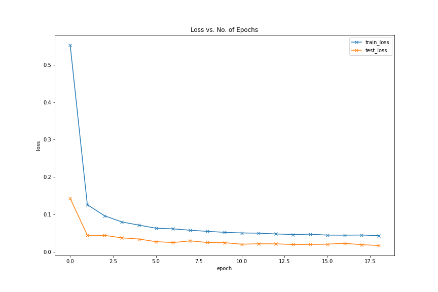
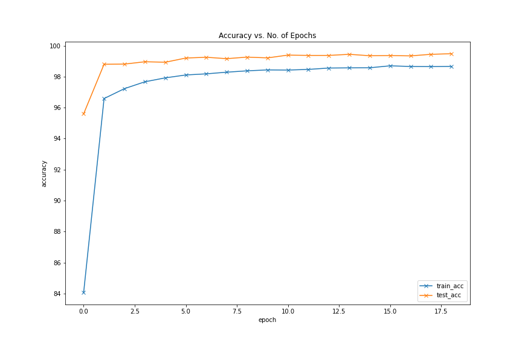

## Problem Statement
Using MNIST data try to achieve a validation accuracy of atleast 99.4% within 19 epochs of training the model and ensuring that the number of parameters are less than 20,000.

## Approach
- Used minimal number of convolutions, with less channels, in accordance with RF required.
- Used Transition layer with MaxPool and Pointwise convolution
- Used GAP layer, instead of linear to get data to 1D. THEN used a fully connected layer.
- Added BN, Dropout(10%), Augmentations - RandomAffine

## Final Best Model
[GitHub Link](MNIST_13K_Params_99_48_Val_Accuracy.ipynb)

[Colab Link](https://colab.research.google.com/drive/1RlAh4-slFVsudz33CuBK4ey1JP5fFcf1?usp=sharing)

### Some Details about the Model
- **Number of Parameters - 13,914**
- **Augmentations - RandomAffine**
- **Dropout - 0.1**
- **Learning Rate - 0.018**
- **Momentum - 0.9**
- **Batch Size - 128**
- **Epochs - 19**
- **Test Accuracy at 19th Epoch - 99.48%**


## Model Architecture
```bash
Net(
  (conv_block_1): Sequential(
    (0): Conv2d(1, 8, kernel_size=(3, 3), stride=(1, 1))
    (1): ReLU()
    (2): BatchNorm2d(8, eps=1e-05, momentum=0.1, affine=True, track_running_stats=True)
    (3): Dropout(p=0.1, inplace=False)
    (4): Conv2d(8, 16, kernel_size=(3, 3), stride=(1, 1))
    (5): ReLU()
    (6): BatchNorm2d(16, eps=1e-05, momentum=0.1, affine=True, track_running_stats=True)
    (7): Dropout(p=0.1, inplace=False)
  )
  (conv_block_2): Sequential(
    (0): Conv2d(16, 32, kernel_size=(3, 3), stride=(1, 1))
    (1): ReLU()
    (2): BatchNorm2d(32, eps=1e-05, momentum=0.1, affine=True, track_running_stats=True)
    (3): Dropout(p=0.1, inplace=False)
  )
  (transition_1): Sequential(
    (0): Conv2d(32, 16, kernel_size=(1, 1), stride=(1, 1))
    (1): ReLU()
    (2): MaxPool2d(kernel_size=2, stride=2, padding=0, dilation=1, ceil_mode=False)
  )
  (conv_block_3): Sequential(
    (0): Conv2d(16, 16, kernel_size=(3, 3), stride=(1, 1))
    (1): ReLU()
    (2): BatchNorm2d(16, eps=1e-05, momentum=0.1, affine=True, track_running_stats=True)
    (3): Dropout(p=0.1, inplace=False)
    (4): Conv2d(16, 32, kernel_size=(3, 3), stride=(1, 1))
    (5): ReLU()
    (6): BatchNorm2d(32, eps=1e-05, momentum=0.1, affine=True, track_running_stats=True)
    (7): Dropout(p=0.1, inplace=False)
  )
  (fc1): Linear(in_features=32, out_features=10, bias=True)
)
```

## Model Parameters

Our model total parameters: **13,914**

```bash
----------------------------------------------------------------
        Layer (type)               Output Shape         Param #
================================================================
            Conv2d-1            [-1, 8, 26, 26]              80
              ReLU-2            [-1, 8, 26, 26]               0
       BatchNorm2d-3            [-1, 8, 26, 26]              16
           Dropout-4            [-1, 8, 26, 26]               0
            Conv2d-5           [-1, 16, 24, 24]           1,168
              ReLU-6           [-1, 16, 24, 24]               0
       BatchNorm2d-7           [-1, 16, 24, 24]              32
           Dropout-8           [-1, 16, 24, 24]               0
            Conv2d-9           [-1, 32, 22, 22]           4,640
             ReLU-10           [-1, 32, 22, 22]               0
      BatchNorm2d-11           [-1, 32, 22, 22]              64
          Dropout-12           [-1, 32, 22, 22]               0
           Conv2d-13           [-1, 16, 22, 22]             528
             ReLU-14           [-1, 16, 22, 22]               0
        MaxPool2d-15           [-1, 16, 11, 11]               0
           Conv2d-16             [-1, 16, 9, 9]           2,320
             ReLU-17             [-1, 16, 9, 9]               0
      BatchNorm2d-18             [-1, 16, 9, 9]              32
          Dropout-19             [-1, 16, 9, 9]               0
           Conv2d-20             [-1, 32, 7, 7]           4,640
             ReLU-21             [-1, 32, 7, 7]               0
      BatchNorm2d-22             [-1, 32, 7, 7]              64
          Dropout-23             [-1, 32, 7, 7]               0
           Linear-24                   [-1, 10]             330
================================================================
Total params: 13,914
Trainable params: 13,914
Non-trainable params: 0
----------------------------------------------------------------
Input size (MB): 0.00
Forward/backward pass size (MB): 1.14
Params size (MB): 0.05
Estimated Total Size (MB): 1.20
----------------------------------------------------------------
```

## Training Log
```bash
  0%|          | 0/469 [00:00<?, ?it/s]============== EPOCH  0
epoch=0 Loss=0.0892619788646698 batch_id=00468: 100%|██████████| 469/469 [00:17<00:00, 26.24it/s]
  0%|          | 0/469 [00:00<?, ?it/s]
Test set: Average loss: 0.1428, Accuracy: 9560/10000 (95.60%)

============== EPOCH  1
epoch=1 Loss=0.11490592360496521 batch_id=00468: 100%|██████████| 469/469 [00:17<00:00, 26.41it/s]
  0%|          | 0/469 [00:00<?, ?it/s]
Test set: Average loss: 0.0440, Accuracy: 9880/10000 (98.80%)

============== EPOCH  2
epoch=2 Loss=0.09968846291303635 batch_id=00468: 100%|██████████| 469/469 [00:17<00:00, 26.06it/s]
  0%|          | 0/469 [00:00<?, ?it/s]
Test set: Average loss: 0.0438, Accuracy: 9881/10000 (98.81%)

============== EPOCH  3
epoch=3 Loss=0.1281680315732956 batch_id=00468: 100%|██████████| 469/469 [00:17<00:00, 26.06it/s]
  0%|          | 0/469 [00:00<?, ?it/s]
Test set: Average loss: 0.0371, Accuracy: 9896/10000 (98.96%)

============== EPOCH  4
epoch=4 Loss=0.026898883283138275 batch_id=00468: 100%|██████████| 469/469 [00:18<00:00, 25.88it/s]
  0%|          | 0/469 [00:00<?, ?it/s]
Test set: Average loss: 0.0339, Accuracy: 9893/10000 (98.93%)

============== EPOCH  5
epoch=5 Loss=0.023440925404429436 batch_id=00468: 100%|██████████| 469/469 [00:18<00:00, 25.79it/s]
  0%|          | 0/469 [00:00<?, ?it/s]
Test set: Average loss: 0.0269, Accuracy: 9920/10000 (99.20%)

============== EPOCH  6
epoch=6 Loss=0.10947438329458237 batch_id=00468: 100%|██████████| 469/469 [00:18<00:00, 25.83it/s]
  0%|          | 0/469 [00:00<?, ?it/s]
Test set: Average loss: 0.0245, Accuracy: 9925/10000 (99.25%)

============== EPOCH  7
epoch=7 Loss=0.0479891411960125 batch_id=00468: 100%|██████████| 469/469 [00:18<00:00, 25.97it/s]
  0%|          | 0/469 [00:00<?, ?it/s]
Test set: Average loss: 0.0290, Accuracy: 9916/10000 (99.16%)

============== EPOCH  8
epoch=8 Loss=0.015595833770930767 batch_id=00468: 100%|██████████| 469/469 [00:18<00:00, 25.84it/s]
  0%|          | 0/469 [00:00<?, ?it/s]
Test set: Average loss: 0.0246, Accuracy: 9926/10000 (99.26%)

============== EPOCH  9
epoch=9 Loss=0.05713915452361107 batch_id=00468: 100%|██████████| 469/469 [00:17<00:00, 26.13it/s]
  0%|          | 0/469 [00:00<?, ?it/s]
Test set: Average loss: 0.0241, Accuracy: 9921/10000 (99.21%)

============== EPOCH  10
epoch=10 Loss=0.018694132566452026 batch_id=00468: 100%|██████████| 469/469 [00:18<00:00, 25.73it/s]
  0%|          | 0/469 [00:00<?, ?it/s]
Test set: Average loss: 0.0201, Accuracy: 9939/10000 (99.39%)

============== EPOCH  11
epoch=11 Loss=0.015891270712018013 batch_id=00468: 100%|██████████| 469/469 [00:18<00:00, 25.93it/s]
  0%|          | 0/469 [00:00<?, ?it/s]
Test set: Average loss: 0.0212, Accuracy: 9937/10000 (99.37%)

============== EPOCH  12
epoch=12 Loss=0.020542984828352928 batch_id=00468: 100%|██████████| 469/469 [00:17<00:00, 26.22it/s]
  0%|          | 0/469 [00:00<?, ?it/s]
Test set: Average loss: 0.0210, Accuracy: 9937/10000 (99.37%)

============== EPOCH  13
epoch=13 Loss=0.02206062525510788 batch_id=00468: 100%|██████████| 469/469 [00:17<00:00, 26.45it/s]
  0%|          | 0/469 [00:00<?, ?it/s]
Test set: Average loss: 0.0193, Accuracy: 9944/10000 (99.44%)

============== EPOCH  14
epoch=14 Loss=0.013751081191003323 batch_id=00468: 100%|██████████| 469/469 [00:17<00:00, 26.43it/s]
  0%|          | 0/469 [00:00<?, ?it/s]
Test set: Average loss: 0.0196, Accuracy: 9935/10000 (99.35%)

============== EPOCH  15
epoch=15 Loss=0.060868799686431885 batch_id=00468: 100%|██████████| 469/469 [00:17<00:00, 26.24it/s]
  0%|          | 0/469 [00:00<?, ?it/s]
Test set: Average loss: 0.0201, Accuracy: 9936/10000 (99.36%)

============== EPOCH  16
epoch=16 Loss=0.07145451754331589 batch_id=00468: 100%|██████████| 469/469 [00:18<00:00, 25.76it/s]
  0%|          | 0/469 [00:00<?, ?it/s]
Test set: Average loss: 0.0225, Accuracy: 9934/10000 (99.34%)

============== EPOCH  17
epoch=17 Loss=0.0233291182667017 batch_id=00468: 100%|██████████| 469/469 [00:18<00:00, 25.50it/s]
  0%|          | 0/469 [00:00<?, ?it/s]
Test set: Average loss: 0.0188, Accuracy: 9944/10000 (99.44%)

============== EPOCH  18
epoch=18 Loss=0.026911074295639992 batch_id=00468: 100%|██████████| 469/469 [00:18<00:00, 25.59it/s]

Test set: Average loss: 0.0167, Accuracy: 9948/10000 (99.48%)
```

**We got ``99.48%`` in 19th epoch.**

## Plots

### Loss vs Num Epochs


### Accuracy vs Num Epochs


### Team Members
Haswanth Aekula, Shreeyash Pawar, Smita Kumari
