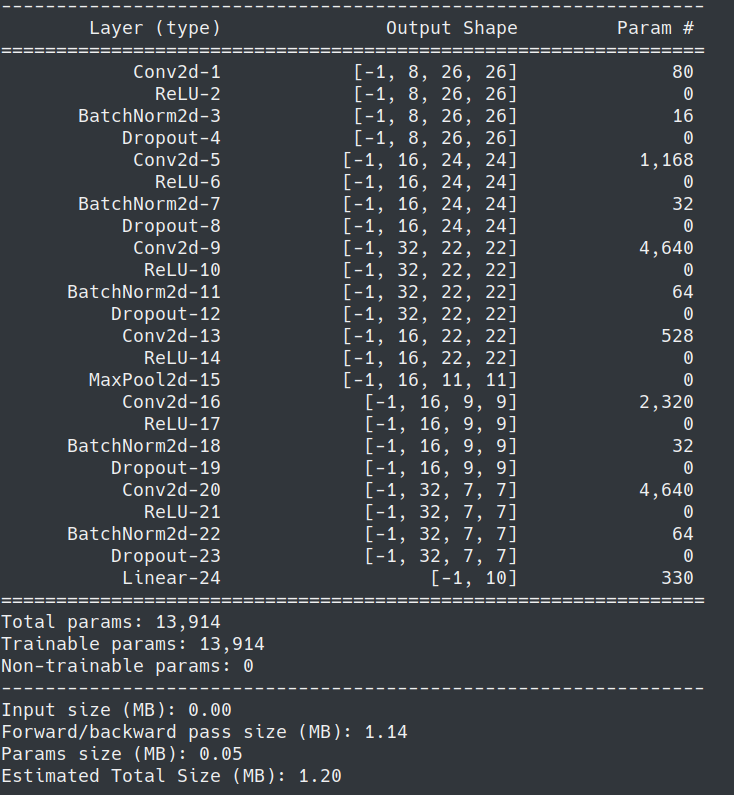
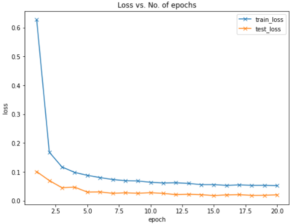
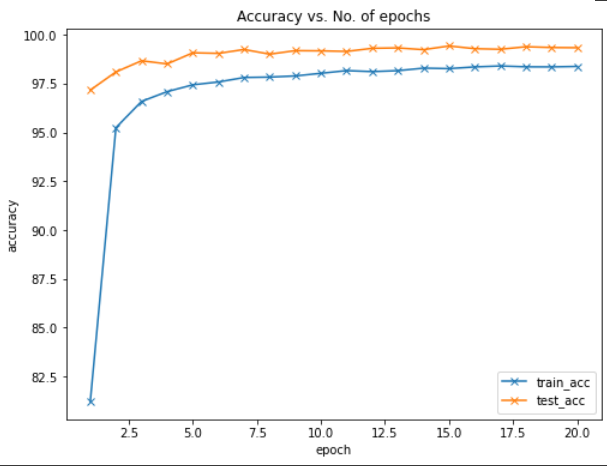

# MNIST using <20K params with 99.4% accuracy

**Approach:**

1. Try to use minimal number of convolutions, with less channels, in accordance with RF required
2. Used Transition layer with MaxPool and Pointwise convolution
3. Used GAP layer, instead of linear to get data to 1D. THEN used a fully connected
4. Try to fit the model as close as possible to 99% without using BN, Dropouts, Augmentation.
5. Added BN, Dropout(10%), Augmenatiions to finally freeze the model

**Architecture:**

Our model required : **13,914 Parameters**



With Input Output & Receptive Fields 
```
----------------------------------------------------------------
        Layer (type)               Output Shape         Param #    # Input      Output      LRF     GRF
================================================================
            Conv2d-1            [-1, 8, 26, 26]              80     28x28x1     26x26x8    3x3      3x3
              ReLU-2            [-1, 8, 26, 26]               0    
       BatchNorm2d-3            [-1, 8, 26, 26]              16
           Dropout-4            [-1, 8, 26, 26]               0     
            Conv2d-5           [-1, 16, 24, 24]           1,168     26x26x8     24x24x16   3x3      5x5
              ReLU-6           [-1, 16, 24, 24]               0
       BatchNorm2d-7           [-1, 16, 24, 24]              32
           Dropout-8           [-1, 16, 24, 24]               0
            Conv2d-9           [-1, 32, 22, 22]           4,640     24x24x16    22x22x32   3x3      7x7
             ReLU-10           [-1, 32, 22, 22]               0
      BatchNorm2d-11           [-1, 32, 22, 22]              64
          Dropout-12           [-1, 32, 22, 22]               0
           Conv2d-13           [-1, 16, 22, 22]             528    22x22x32    22x22x16    3x3      7x7
             ReLU-14           [-1, 16, 22, 22]               0
        MaxPool2d-15           [-1, 16, 11, 11]               0                                     14x14
           Conv2d-16             [-1, 16, 9, 9]           2,320    11x11x16    9x9x16      3x3      16x16
             ReLU-17             [-1, 16, 9, 9]               0
      BatchNorm2d-18             [-1, 16, 9, 9]              32
          Dropout-19             [-1, 16, 9, 9]               0
           Conv2d-20             [-1, 32, 7, 7]           4,640    9x9x16      7x7x32      3x3     18x18
             ReLU-21             [-1, 32, 7, 7]               0
```
**Model Layers:** 


```bash
Net(
  (conv_block_1): Sequential(
    (0): Conv2d(1, 8, kernel_size=(3, 3), stride=(1, 1))
    (1): ReLU()
    (2): BatchNorm2d(8, eps=1e-05, momentum=0.1, affine=True, track_running_stats=True)
    (3): Dropout(p=0.1, inplace=False)
    (4): Conv2d(8, 16, kernel_size=(3, 3), stride=(1, 1))
    (5): ReLU()
    (6): BatchNorm2d(16, eps=1e-05, momentum=0.1, affine=True, track_running_stats=True)
    (7): Dropout(p=0.1, inplace=False)
  )
  (conv_block_2): Sequential(
    (0): Conv2d(16, 32, kernel_size=(3, 3), stride=(1, 1))
    (1): ReLU()
    (2): BatchNorm2d(32, eps=1e-05, momentum=0.1, affine=True, track_running_stats=True)
    (3): Dropout(p=0.1, inplace=False)
  )
  (transition_1): Sequential(
    (0): Conv2d(32, 16, kernel_size=(1, 1), stride=(1, 1))
    (1): ReLU()
    (2): MaxPool2d(kernel_size=2, stride=2, padding=0, dilation=1, ceil_mode=False)
  )
  (conv_block_3): Sequential(
    (0): Conv2d(16, 16, kernel_size=(3, 3), stride=(1, 1))
    (1): ReLU()
    (2): BatchNorm2d(16, eps=1e-05, momentum=0.1, affine=True, track_running_stats=True)
    (3): Dropout(p=0.1, inplace=False)
    (4): Conv2d(16, 32, kernel_size=(3, 3), stride=(1, 1))
    (5): ReLU()
    (6): BatchNorm2d(32, eps=1e-05, momentum=0.1, affine=True, track_running_stats=True)
    (7): Dropout(p=0.1, inplace=False)
  )
  (fc1): Linear(in_features=32, out_features=10, bias=True)
)
```

**Training log:**

```bash
0%|          | 0/469 [00:00<?, ?it/s]
============== EPOCH  0
/usr/local/lib/python3.7/dist-packages/ipykernel_launcher.py:156: UserWarning: Implicit dimension choice for log_softmax has been deprecated. Change the call to include dim=X as an argument.
100%|██████████| 469/469 [00:18<00:00, 25.75it/s]
  0%|          | 0/469 [00:00<?, ?it/s]

Test set: Average loss: 0.1011, Accuracy: 9717/10000 (97.17%)

============== EPOCH  1
100%|██████████| 469/469 [00:18<00:00, 25.70it/s]
  0%|          | 0/469 [00:00<?, ?it/s]

Test set: Average loss: 0.0702, Accuracy: 9810/10000 (98.10%)

============== EPOCH  2
100%|██████████| 469/469 [00:18<00:00, 25.35it/s]
  0%|          | 0/469 [00:00<?, ?it/s]

Test set: Average loss: 0.0453, Accuracy: 9867/10000 (98.67%)

============== EPOCH  3
100%|██████████| 469/469 [00:18<00:00, 25.25it/s]
  0%|          | 0/469 [00:00<?, ?it/s]

Test set: Average loss: 0.0473, Accuracy: 9851/10000 (98.51%)

============== EPOCH  4
100%|██████████| 469/469 [00:18<00:00, 25.52it/s]
  0%|          | 0/469 [00:00<?, ?it/s]

Test set: Average loss: 0.0302, Accuracy: 9908/10000 (99.08%)

============== EPOCH  5
100%|██████████| 469/469 [00:18<00:00, 25.26it/s]
  0%|          | 0/469 [00:00<?, ?it/s]

Test set: Average loss: 0.0308, Accuracy: 9905/10000 (99.05%)

============== EPOCH  6
100%|██████████| 469/469 [00:18<00:00, 25.49it/s]
  0%|          | 0/469 [00:00<?, ?it/s]

Test set: Average loss: 0.0259, Accuracy: 9925/10000 (99.25%)

============== EPOCH  7
100%|██████████| 469/469 [00:18<00:00, 25.33it/s]
  0%|          | 0/469 [00:00<?, ?it/s]

Test set: Average loss: 0.0277, Accuracy: 9901/10000 (99.01%)

============== EPOCH  8
100%|██████████| 469/469 [00:18<00:00, 25.36it/s]
  0%|          | 0/469 [00:00<?, ?it/s]

Test set: Average loss: 0.0261, Accuracy: 9919/10000 (99.19%)

============== EPOCH  9
100%|██████████| 469/469 [00:18<00:00, 25.38it/s]
  0%|          | 0/469 [00:00<?, ?it/s]

Test set: Average loss: 0.0281, Accuracy: 9918/10000 (99.18%)

============== EPOCH  10
100%|██████████| 469/469 [00:18<00:00, 25.09it/s]
  0%|          | 0/469 [00:00<?, ?it/s]

Test set: Average loss: 0.0257, Accuracy: 9915/10000 (99.15%)

============== EPOCH  11
100%|██████████| 469/469 [00:18<00:00, 25.17it/s]
  0%|          | 0/469 [00:00<?, ?it/s]

Test set: Average loss: 0.0214, Accuracy: 9931/10000 (99.31%)

============== EPOCH  12
100%|██████████| 469/469 [00:18<00:00, 25.47it/s]
  0%|          | 0/469 [00:00<?, ?it/s]

Test set: Average loss: 0.0226, Accuracy: 9933/10000 (99.33%)

============== EPOCH  13
100%|██████████| 469/469 [00:18<00:00, 25.67it/s]
  0%|          | 0/469 [00:00<?, ?it/s]

Test set: Average loss: 0.0211, Accuracy: 9924/10000 (99.24%)

============== EPOCH  14
100%|██████████| 469/469 [00:18<00:00, 25.15it/s]
  0%|          | 0/469 [00:00<?, ?it/s]

Test set: Average loss: 0.0182, Accuracy: 9943/10000 (99.43%)

============== EPOCH  15
100%|██████████| 469/469 [00:18<00:00, 25.37it/s]
  0%|          | 0/469 [00:00<?, ?it/s]

Test set: Average loss: 0.0205, Accuracy: 9929/10000 (99.29%)

============== EPOCH  16
100%|██████████| 469/469 [00:18<00:00, 25.52it/s]
  0%|          | 0/469 [00:00<?, ?it/s]

Test set: Average loss: 0.0212, Accuracy: 9926/10000 (99.26%)

============== EPOCH  17
100%|██████████| 469/469 [00:18<00:00, 25.17it/s]
  0%|          | 0/469 [00:00<?, ?it/s]

Test set: Average loss: 0.0188, Accuracy: 9939/10000 (99.39%)

============== EPOCH  18
100%|██████████| 469/469 [00:18<00:00, 25.66it/s]
  0%|          | 0/469 [00:00<?, ?it/s]

Test set: Average loss: 0.0191, Accuracy: 9935/10000 (99.35%)

============== EPOCH  19
100%|██████████| 469/469 [00:18<00:00, 25.24it/s]

Test set: Average loss: 0.0207, Accuracy: 9934/10000 (99.34%)
```

We get 99.43% in 14th epoch

**Metrics:**

Loss vs Num Epochs



Accuracy vs Num Epochs

