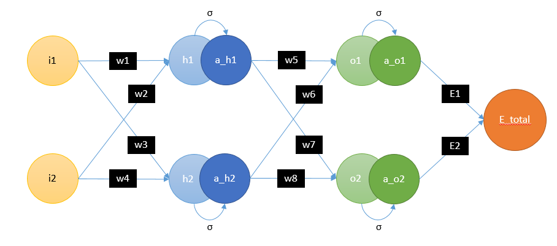

# Back Propagation
We are using ``Gradient Descent`` algorithm to update our weights.

## Model Architecture
Below is the neural network architecture which has one input layer, one hidden layer and one output layer. Every layer is a fully connected layer.

## Gradient Descent
We will be using ``Gradient Descent`` algorithm to update our weights. Below is the equation used to update each weight.

## Forward Propagation
At hidden layer, we have ``h1`` and ``h2`` neurons whose values can be calculated using below equations:

 

Activation of hidden layer neurons ``h1`` and ``h2`` are ``a_h1`` and ``a_h2`` respectively whose values can be calculated using below equations:

 

At output layer, we have ``o1`` and ``o2`` neurons whose values can be calculated using below equations:

 

Activation of output layer neurons ``o1`` and ``o2`` are ``a_o1`` and ``a_o2`` respectively whose values can be calculated using below equations:

 

And if we look at the architecture, we can see that our total loss (``E_total``) is

where,

<a href="https://www.codecogs.com/eqnedit.php?latex=\dpi{120}&space;\begin{multline}&space;{\color{Black}&space;E_1&space;=&space;\frac&space;{1}{2}&space;*&space;(t_1&space;-&space;a\_o_1)^2&space;\&space;,&space;\&space;where&space;\&space;\&space;t_1&space;\&space;\&space;is&space;\&space;\&space;target_1}&space;\\&space;\\&space;E_2&space;=&space;\frac&space;{1}{2}&space;*&space;(t_2&space;-&space;a\_o_2)^2&space;\&space;,&space;\&space;where&space;\&space;\&space;t_2&space;\&space;\&space;is&space;\&space;\&space;target_2&space;\end{multline}" target="_blank"></a>

## Back Propagation using Gradient Descent
We need to find the gradient of ``E_total`` w.r.t ``w1``, ``w2``, ``w3``, ``w4``, ``w5``, ``w6``, ``w7``, ``w8``

<a href="https://www.codecogs.com/eqnedit.php?latex=\dpi{120}&space;\frac{\partial&space;E_{total}}{\partial&space;W_{i}}&space;=&space;\lbrack&space;\frac{\partial&space;E_{total}}{\partial&space;w_1},&space;\frac{\partial&space;E_{total}}{\partial&space;w_2},&space;\frac{\partial&space;E_{total}}{\partial&space;w_3},&space;\frac{\partial&space;E_{total}}{\partial&space;w_4},&space;\frac{\partial&space;E_{total}}{\partial&space;w_5},&space;\frac{\partial&space;E_{total}}{\partial&space;w_6},&space;\frac{\partial&space;E_{total}}{\partial&space;w_7},&space;\frac{\partial&space;E_{total}}{\partial&space;w_8}&space;\rbrack" target="_blank"></a>
 

First let's calculate the gradient of ``E_total`` w.r.t hidden layer weights (``w5``, ``w6``, ``w7``, ``w8``)

 

Since, ``w5`` has no effect with ``E2`` and by using the chain rule we can write the above equation like below:

 

Now let's calculate it step by step:

 

 

 

By using above equations we can now calculate the gradient of ``E_total`` w.r.t ``w5`` which is

 

Similarly we can calculate the gradient of ``E_total`` w.r.t ``w6``, ``w7``, ``w8``

 

 

 

Now let's calculate the gradient of ``E_total`` w.r.t input layer weights (``w1``, ``w2``, ``w3``, ``w4``)

 

We can take part of the above equation and write it like below:

<a href="https://www.codecogs.com/eqnedit.php?latex=\dpi{120}&space;\frac{\partial&space;E_{total}}{\partial&space;a\_o_1}&space;*&space;\frac{\partial&space;a\_o_1}{\partial&space;o_1&space;}&space;*&space;\frac{\partial&space;o_1}{\partial&space;a\_h_1}&space;=&space;\frac{\partial&space;E_{total}}{\partial&space;a\_h_1}&space;=&space;\frac{\partial&space;(E_1&plus;E_2)}{\partial&space;a\_h_1}&space;=&space;\frac{\partial&space;E_1}{\partial&space;a\_h_1}&space;&plus;&space;\frac{\partial&space;E_2}{\partial&space;a\_h_1}" target="_blank"></a>
 

Now,

 

 

Therefore,

 

Similarly,

 

And,

 

 

Therefore, the gradient of ``E_total`` w.r.t ``w1`` is

 

 

Similarly, the gradient of ``E_total`` w.r.t ``w2`` is

 

 

Similarly, the gradient of ``E_total`` w.r.t ``w3`` is

 

 

Similarly, the gradient of ``E_total`` w.r.t ``w4`` is

 

 

That's it!! Now we can update the weights using the below equation:

