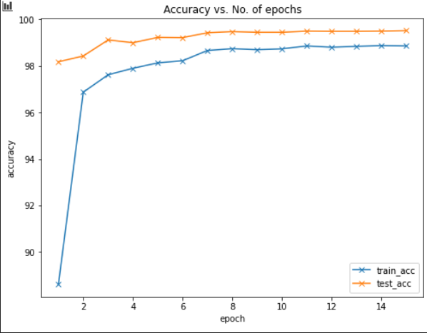

## Problem Statement

Using MNIST data try to achieve a validation accuracy of **99.4% consistently for last few epochs within 15 epochs** of training the model and ensuring that the number of parameters are less than **10,000**, even better if it's below **8,000** parameters.

## Approach
- Setup the basic model and data pipelines.
- Tried to get parameters <10k, observed the model was overfitting.
- To compensate for overfitting, add reguralisation (dropouts, augmentations, reduce params further to 7.2k), observed the model was underfitting.
- Reduced the reguralisation parameters(removed dropout, reduced augmentation), added LR schedular for even training, this gave consistent >99.4% for last 4 epochs. (Train: 98.75, params: 7.3k)
- Tried to outdo last experiment, to get close to 8k params (7.7k) by increasing channel size in some convolution blocks. Gave >99.4% for last 9 epochs, with **99.52 as final** test accuracy

## Experiments
| Experiment Notebook         | Target                                                                                                                                       | Info                                                                                                                                                                                                             | Params | Best Train Accuracy | Best Test Accuracy | Analysis                                                                                                                                                                                                                                                                                                                                   |
|-----------------------------|----------------------------------------------------------------------------------------------------------------------------------------------|------------------------------------------------------------------------------------------------------------------------------------------------------------------------------------------------------------------|--------|---------------------|--------------------|--------------------------------------------------------------------------------------------------------------------------------------------------------------------------------------------------------------------------------------------------------------------------------------------------------------------------------------------|
| [MNIST_Skeleton_Experiment_1](MNIST_Skeleton_Experiment_1.ipynb) | Created basic setup, with data training and prediction pipelines.                                                                            | Used the last assignment model as starting point.                                                                                                                                                                | 13,914 | 98.2                | 99.36              | • We setup the basic pipeline.<br> • Since our target is less than 10k params, we will try to reduce the capacity of model in next experiment                                                                                                                                                                                              |
| [MNIST_99_22_Experiment_2](MNIST_99_22_Experiment_2.ipynb)    | Get parameters model of just within  10k, using 15 epochs.                                                                                   | • Tried to get model below  10k parameters<br> • Using fully connected layer  for now,to establish a baseline                                                                                              | 9.3k   | 99.64               | 99.21              | • The model is overfitting, as clearly seen at last epoch with accuracy of 99.64<br> • The only possible updates for test accuracy were ~ 100-99.64 =~ 0.04 , which would have got test accuracy to 99.25 at best case.<br> • Hence we need to reduce capacity of model, which we will try in next iteration.                                      |
| [MNIST_99_37_Experiment_3](MNIST_99_37_Experiment_3.ipynb)    | Aim to reduce capacity of model to avoid overfitting.                                                                                        | Reguralised model with:<br> • Reducing parameters (removing bias, and additional convolution layer)<br> • Introducing Dropout<br> • Introducing Augmentation<br> • GAP, used pointwise as final output layer before GAP      | 7.3k   | 98.28               | 99.37              |<br> • We see that model is underfitting!<br> • Because we tried to reduce capacity, introduced dropout, Augmentation all at once. Which had combined effect of lowering the training accuracy We reached 99.39 once, hence maybe use LR_scheduler for even loss.<br> • In next attempt, we will remove these excessive regularisation                         |
| [MNIST_99_41_Experiment_4](MNIST_99_41_Experiment_4.ipynb)    | Aim to reduce the underfitting, by lowering the regularization.                                                                              | Lower the Reguralisation with:<br> • Removed all dropouts, since already the parameters are very less<br> • Removed Random_crop, reduced the Augmentation parameters<br> Also added Step_LR scheduler to smooth out training | 7,288  | 98.75               | 99.43              | Best model so far, that consistently gave >99.4% for last 4 epochs<br> • There is still room for improvement as training accuracy was only 98.75, so increasing the capacity might help<br> • We got 99.43 once, in 8th epoch but it dropped to 99.37, and, although recovered in the end, hence we try to make it smoother. |
| [MNIST_99_52_Experiment_5](MNIST_99_52_Experiment_5.ipynb)    | Aim improve upon the little wiggle room from the last model where got consistent >99.4 in last epochs, by trying to increase the parameters. | Just changed the channels in first 2 convolution blocks from 8 to 9. This way we are still under 8k params                                                                                                       | 7,753  | 98.86               | **99.52**          | Best model so far, that consistently gave **>99.4% for last 9 epochs**  But we didn't want to consider this as the best model because:<br> • The parameters used are almost 600 higher than previous, where we still got consistent >99.4<br> • It's Saturday, shubh din, we didn't want to take unlucky number like 9 as n_channels                           |


## Info for Best models (Experiment 4 & 5)

### Experiment 4
#### Model Architecure
```
Net(
  (conv_block_1): Sequential(
    (0): Conv2d(1, 8, kernel_size=(3, 3), stride=(1, 1), bias=False)
    (1): ReLU()
    (2): BatchNorm2d(8, eps=1e-05, momentum=0.1, affine=True, track_running_stats=True)
    (3): Conv2d(8, 8, kernel_size=(3, 3), stride=(1, 1), bias=False)
    (4): ReLU()
    (5): BatchNorm2d(8, eps=1e-05, momentum=0.1, affine=True, track_running_stats=True)
  )
  (conv_block_2): Sequential(
    (0): Conv2d(8, 8, kernel_size=(3, 3), stride=(1, 1), bias=False)
    (1): ReLU()
    (2): BatchNorm2d(8, eps=1e-05, momentum=0.1, affine=True, track_running_stats=True)
  )
  (transition_1): Sequential(
    (0): MaxPool2d(kernel_size=2, stride=2, padding=0, dilation=1, ceil_mode=False)
  )
  (conv_block_3): Sequential(
    (0): Conv2d(8, 16, kernel_size=(3, 3), stride=(1, 1), bias=False)
    (1): ReLU()
    (2): BatchNorm2d(16, eps=1e-05, momentum=0.1, affine=True, track_running_stats=True)
    (3): Conv2d(16, 16, kernel_size=(3, 3), stride=(1, 1), bias=False)
    (4): ReLU()
    (5): BatchNorm2d(16, eps=1e-05, momentum=0.1, affine=True, track_running_stats=True)
    (6): Conv2d(16, 16, kernel_size=(3, 3), stride=(1, 1), bias=False)
    (7): ReLU()
    (8): BatchNorm2d(16, eps=1e-05, momentum=0.1, affine=True, track_running_stats=True)
    (9): Conv2d(16, 10, kernel_size=(1, 1), stride=(1, 1), bias=False)
  )
  (gap): Sequential(
    (0): AvgPool2d(kernel_size=5, stride=5, padding=0)
  )
)
```

#### Model Parameters
```
-----------------------------------------------------------------------------------------------------
        Layer (type)               Output Shape         Param #        Input        Output      RF
=====================================================================================================
            Conv2d-1            [-1, 8, 26, 26]              72        28x28        26x26       3x3
              ReLU-2            [-1, 8, 26, 26]               0
       BatchNorm2d-3            [-1, 8, 26, 26]              16
            Conv2d-4            [-1, 8, 24, 24]             576        26x26        24x24       5x5
              ReLU-5            [-1, 8, 24, 24]               0
       BatchNorm2d-6            [-1, 8, 24, 24]              16
            Conv2d-7            [-1, 8, 22, 22]             576        24x24        22x22       7x7
              ReLU-8            [-1, 8, 22, 22]               0
       BatchNorm2d-9            [-1, 8, 22, 22]              16
        MaxPool2d-10            [-1, 8, 11, 11]               0        22x22        11x11       7x7
           Conv2d-11             [-1, 16, 9, 9]           1,152        11x11         9x9       11x11
             ReLU-12             [-1, 16, 9, 9]               0
      BatchNorm2d-13             [-1, 16, 9, 9]              32
           Conv2d-14             [-1, 16, 7, 7]           2,304         9x9          7x7       15x15
             ReLU-15             [-1, 16, 7, 7]               0
      BatchNorm2d-16             [-1, 16, 7, 7]              32
           Conv2d-17             [-1, 16, 5, 5]           2,304         7x7          5x5       19x19
             ReLU-18             [-1, 16, 5, 5]               0
      BatchNorm2d-19             [-1, 16, 5, 5]              32
           Conv2d-20             [-1, 10, 5, 5]             160         5x5          5x5       19x19
        AvgPool2d-21             [-1, 10, 1, 1]               0         5x5          1x1       27x27
=====================================================================================================
Total params: 7,288
Trainable params: 7,288
Non-trainable params: 0
----------------------------------------------------------------
Input size (MB): 0.00
Forward/backward pass size (MB): 0.38
Params size (MB): 0.03
Estimated Total Size (MB): 0.41
----------------------------------------------------------------
```
#### Training Log
```
 0%|          | 0/469 [00:00<?, ?it/s]============== EPOCH  0
100%|██████████| 469/469 [00:17<00:00, 27.11it/s]
  0%|          | 0/469 [00:00<?, ?it/s]	 Train accuracy : 86.80333333333333 , Test Accuracy: 97.78
	 Train Loss: 0.45093635460143405 , Test Loss: 0.07462896285057068
============== EPOCH  1
100%|██████████| 469/469 [00:17<00:00, 27.31it/s]
  0%|          | 0/469 [00:00<?, ?it/s]	 Train accuracy : 96.905 , Test Accuracy: 98.52
	 Train Loss: 0.10777327538267381 , Test Loss: 0.0464475081205368
============== EPOCH  2
100%|██████████| 469/469 [00:16<00:00, 27.79it/s]
  0%|          | 0/469 [00:00<?, ?it/s]	 Train accuracy : 97.575 , Test Accuracy: 99.03
	 Train Loss: 0.08294396853443783 , Test Loss: 0.02984009292125702
============== EPOCH  3
100%|██████████| 469/469 [00:16<00:00, 27.61it/s]
  0%|          | 0/469 [00:00<?, ?it/s]	 Train accuracy : 97.84833333333334 , Test Accuracy: 98.62
	 Train Loss: 0.07315661113605952 , Test Loss: 0.03978343122005463
============== EPOCH  4
100%|██████████| 469/469 [00:17<00:00, 27.49it/s]
  0%|          | 0/469 [00:00<?, ?it/s]	 Train accuracy : 97.905 , Test Accuracy: 99.04
	 Train Loss: 0.06863106392832326 , Test Loss: 0.027060787129402162
============== EPOCH  5
100%|██████████| 469/469 [00:17<00:00, 27.05it/s]
  0%|          | 0/469 [00:00<?, ?it/s]	 Train accuracy : 98.22999999999999 , Test Accuracy: 99.13
	 Train Loss: 0.05995824838926924 , Test Loss: 0.02573868453502655
============== EPOCH  6
100%|██████████| 469/469 [00:16<00:00, 28.06it/s]
  0%|          | 0/469 [00:00<?, ?it/s]	 Train accuracy : 98.51666666666667 , Test Accuracy: 99.4
	 Train Loss: 0.04762922262332078 , Test Loss: 0.01858070379495621
============== EPOCH  7
100%|██████████| 469/469 [00:16<00:00, 28.05it/s]
  0%|          | 0/469 [00:00<?, ?it/s]	 Train accuracy : 98.65666666666667 , Test Accuracy: 99.37
	 Train Loss: 0.04491162635703712 , Test Loss: 0.018523097681999206
============== EPOCH  8
100%|██████████| 469/469 [00:16<00:00, 28.20it/s]
  0%|          | 0/469 [00:00<?, ?it/s]	 Train accuracy : 98.71666666666667 , Test Accuracy: 99.43
	 Train Loss: 0.04326656994932115 , Test Loss: 0.017832859337329865
============== EPOCH  9
100%|██████████| 469/469 [00:17<00:00, 27.45it/s]
  0%|          | 0/469 [00:00<?, ?it/s]	 Train accuracy : 98.69666666666667 , Test Accuracy: 99.42
	 Train Loss: 0.04334301823007463 , Test Loss: 0.017871690917015074
============== EPOCH  10
100%|██████████| 469/469 [00:16<00:00, 27.85it/s]
  0%|          | 0/469 [00:00<?, ?it/s]	 Train accuracy : 98.67333333333333 , Test Accuracy: 99.38
	 Train Loss: 0.04447758722422855 , Test Loss: 0.017391211557388306
============== EPOCH  11
100%|██████████| 469/469 [00:16<00:00, 28.26it/s]
  0%|          | 0/469 [00:00<?, ?it/s]	 Train accuracy : 98.775 , Test Accuracy: 99.41
	 Train Loss: 0.041368063154028675 , Test Loss: 0.01712459658384323
============== EPOCH  12
100%|██████████| 469/469 [00:16<00:00, 28.62it/s]
  0%|          | 0/469 [00:00<?, ?it/s]	 Train accuracy : 98.75833333333334 , Test Accuracy: 99.42
	 Train Loss: 0.041047947918142334 , Test Loss: 0.01690357506275177
============== EPOCH  13
100%|██████████| 469/469 [00:16<00:00, 28.46it/s]
  0%|          | 0/469 [00:00<?, ?it/s]	 Train accuracy : 98.715 , Test Accuracy: 99.42
	 Train Loss: 0.042690624540516815 , Test Loss: 0.016963836002349852
============== EPOCH  14
100%|██████████| 469/469 [00:16<00:00, 28.27it/s]
	 Train accuracy : 98.75500000000001 , Test Accuracy: 99.41
	 Train Loss: 0.04199653674862278 , Test Loss: 0.01712730197906494
```

#### Accuracy vs Epochs



### Experiment 5
#### Model Architecure
```
Net(
  (conv_block_1): Sequential(
    (0): Conv2d(1, 9, kernel_size=(3, 3), stride=(1, 1), bias=False)
    (1): ReLU()
    (2): BatchNorm2d(9, eps=1e-05, momentum=0.1, affine=True, track_running_stats=True)
    (3): Conv2d(9, 9, kernel_size=(3, 3), stride=(1, 1), bias=False)
    (4): ReLU()
    (5): BatchNorm2d(9, eps=1e-05, momentum=0.1, affine=True, track_running_stats=True)
  )
  (conv_block_2): Sequential(
    (0): Conv2d(9, 9, kernel_size=(3, 3), stride=(1, 1), bias=False)
    (1): ReLU()
    (2): BatchNorm2d(9, eps=1e-05, momentum=0.1, affine=True, track_running_stats=True)
  )
  (transition_1): Sequential(
    (0): MaxPool2d(kernel_size=2, stride=2, padding=0, dilation=1, ceil_mode=False)
  )
  (conv_block_3): Sequential(
    (0): Conv2d(9, 16, kernel_size=(3, 3), stride=(1, 1), bias=False)
    (1): ReLU()
    (2): BatchNorm2d(16, eps=1e-05, momentum=0.1, affine=True, track_running_stats=True)
    (3): Conv2d(16, 16, kernel_size=(3, 3), stride=(1, 1), bias=False)
    (4): ReLU()
    (5): BatchNorm2d(16, eps=1e-05, momentum=0.1, affine=True, track_running_stats=True)
    (6): Conv2d(16, 16, kernel_size=(3, 3), stride=(1, 1), bias=False)
    (7): ReLU()
    (8): BatchNorm2d(16, eps=1e-05, momentum=0.1, affine=True, track_running_stats=True)
    (9): Conv2d(16, 10, kernel_size=(1, 1), stride=(1, 1), bias=False)
  )
  (gap): Sequential(
    (0): AvgPool2d(kernel_size=5, stride=5, padding=0)
  )
)
```

#### Model Parameters
```
-----------------------------------------------------------------------------------------------------
        Layer (type)               Output Shape         Param #        Input        Output      RF
=====================================================================================================
            Conv2d-1            [-1, 9, 26, 26]              81        28x28        26x26       3x3
              ReLU-2            [-1, 9, 26, 26]               0
       BatchNorm2d-3            [-1, 9, 26, 26]              18
            Conv2d-4            [-1, 9, 24, 24]             729        26x26        24x24       5x5
              ReLU-5            [-1, 9, 24, 24]               0
       BatchNorm2d-6            [-1, 9, 24, 24]              18
            Conv2d-7            [-1, 9, 22, 22]             729        24x24        22x22       7x7
              ReLU-8            [-1, 9, 22, 22]               0
       BatchNorm2d-9            [-1, 9, 22, 22]              18
        MaxPool2d-10            [-1, 9, 11, 11]               0        22x22        11x11       7x7
           Conv2d-11             [-1, 16, 9, 9]           1,296        11x11         9x9       11x11
             ReLU-12             [-1, 16, 9, 9]               0
      BatchNorm2d-13             [-1, 16, 9, 9]              32
           Conv2d-14             [-1, 16, 7, 7]           2,304         9x9          7x7       15x15
             ReLU-15             [-1, 16, 7, 7]               0
      BatchNorm2d-16             [-1, 16, 7, 7]              32
           Conv2d-17             [-1, 16, 5, 5]           2,304         7x7          5x5       19x19
             ReLU-18             [-1, 16, 5, 5]               0
      BatchNorm2d-19             [-1, 16, 5, 5]              32
           Conv2d-20             [-1, 10, 5, 5]             160         5x5          5x5       19x19
        AvgPool2d-21             [-1, 10, 1, 1]               0         5x5          1x1       27x27
=====================================================================================================
Total params: 7,753
Trainable params: 7,753
Non-trainable params: 0
----------------------------------------------------------------
Input size (MB): 0.00
Forward/backward pass size (MB): 0.42
Params size (MB): 0.03
Estimated Total Size (MB): 0.46
----------------------------------------------------------------
```
#### Training Log
```
  0%|          | 0/469 [00:00<?, ?it/s]============== EPOCH  0
100%|██████████| 469/469 [00:16<00:00, 27.65it/s]
  0%|          | 0/469 [00:00<?, ?it/s]	 Train accuracy : 88.61333333333333 , Test Accuracy: 98.18
	 Train Loss: 0.41383629409806816 , Test Loss: 0.06689922139644623
============== EPOCH  1
100%|██████████| 469/469 [00:16<00:00, 28.21it/s]
  0%|          | 0/469 [00:00<?, ?it/s]	 Train accuracy : 96.87166666666667 , Test Accuracy: 98.43
	 Train Loss: 0.10720437084799254 , Test Loss: 0.053271932864189145
============== EPOCH  2
100%|██████████| 469/469 [00:16<00:00, 28.29it/s]
  0%|          | 0/469 [00:00<?, ?it/s]	 Train accuracy : 97.62166666666666 , Test Accuracy: 99.12
	 Train Loss: 0.08032670029317901 , Test Loss: 0.02898362009525299
============== EPOCH  3
100%|██████████| 469/469 [00:16<00:00, 28.44it/s]
  0%|          | 0/469 [00:00<?, ?it/s]	 Train accuracy : 97.89999999999999 , Test Accuracy: 99.0
	 Train Loss: 0.07017088781939006 , Test Loss: 0.028190976548194885
============== EPOCH  4
100%|██████████| 469/469 [00:16<00:00, 28.34it/s]
  0%|          | 0/469 [00:00<?, ?it/s]	 Train accuracy : 98.13333333333333 , Test Accuracy: 99.23
	 Train Loss: 0.06184998878252023 , Test Loss: 0.025577700924873353
============== EPOCH  5
100%|██████████| 469/469 [00:16<00:00, 28.34it/s]
  0%|          | 0/469 [00:00<?, ?it/s]	 Train accuracy : 98.22666666666666 , Test Accuracy: 99.22
	 Train Loss: 0.05844225289661493 , Test Loss: 0.02483844819068909
============== EPOCH  6
100%|██████████| 469/469 [00:16<00:00, 28.40it/s]
  0%|          | 0/469 [00:00<?, ?it/s]	 Train accuracy : 98.66666666666667 , Test Accuracy: 99.43
	 Train Loss: 0.04493386101033261 , Test Loss: 0.01824666726589203
============== EPOCH  7
100%|██████████| 469/469 [00:16<00:00, 28.40it/s]
  0%|          | 0/469 [00:00<?, ?it/s]	 Train accuracy : 98.745 , Test Accuracy: 99.48
	 Train Loss: 0.04294614022029743 , Test Loss: 0.017547343230247498
============== EPOCH  8
100%|██████████| 469/469 [00:16<00:00, 28.49it/s]
  0%|          | 0/469 [00:00<?, ?it/s]	 Train accuracy : 98.70166666666667 , Test Accuracy: 99.45
	 Train Loss: 0.04233295112641763 , Test Loss: 0.017679552245140076
============== EPOCH  9
100%|██████████| 469/469 [00:16<00:00, 28.54it/s]
  0%|          | 0/469 [00:00<?, ?it/s]	 Train accuracy : 98.73666666666666 , Test Accuracy: 99.45
	 Train Loss: 0.04031123899058429 , Test Loss: 0.017382057332992553
============== EPOCH  10
100%|██████████| 469/469 [00:16<00:00, 27.85it/s]
  0%|          | 0/469 [00:00<?, ?it/s]	 Train accuracy : 98.86166666666666 , Test Accuracy: 99.5
	 Train Loss: 0.03907421720561696 , Test Loss: 0.01687406256198883
============== EPOCH  11
100%|██████████| 469/469 [00:16<00:00, 27.62it/s]
  0%|          | 0/469 [00:00<?, ?it/s]	 Train accuracy : 98.80666666666667 , Test Accuracy: 99.49
	 Train Loss: 0.040440969723167575 , Test Loss: 0.017231711459159853
============== EPOCH  12
100%|██████████| 469/469 [00:17<00:00, 27.49it/s]
  0%|          | 0/469 [00:00<?, ?it/s]	 Train accuracy : 98.845 , Test Accuracy: 99.49
	 Train Loss: 0.03883499924593897 , Test Loss: 0.016534411430358886
============== EPOCH  13
100%|██████████| 469/469 [00:16<00:00, 28.54it/s]
  0%|          | 0/469 [00:00<?, ?it/s]	 Train accuracy : 98.875 , Test Accuracy: 99.5
	 Train Loss: 0.03839864972621393 , Test Loss: 0.016658856630325316
============== EPOCH  14
100%|██████████| 469/469 [00:16<00:00, 28.46it/s]
	 Train accuracy : 98.86166666666666 , Test Accuracy: 99.52
	 Train Loss: 0.037885162705329184 , Test Loss: 0.01640024402141571
```

#### Accuracy vs Epochs


## Team Members
- Shreeyash Pawar([shreeyash.s.pawar@gmail.com](mailto:shreeyash.s.pawar@gmail.com))
- Haswanth Aekula([haswanth.kumar.39@gmail.com](mailto:haswanth.kumar.39@gmail.com))
- Smita Kumari


