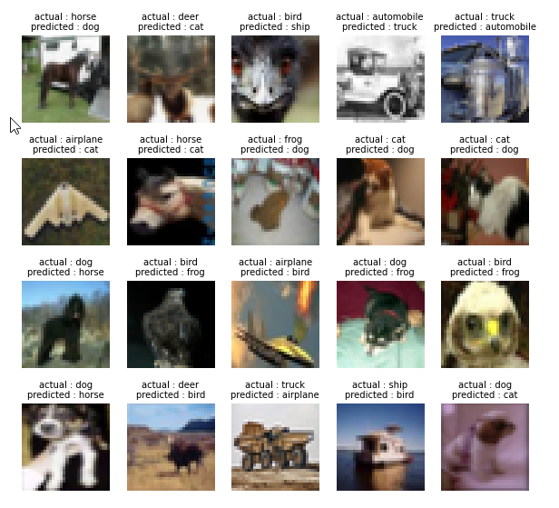
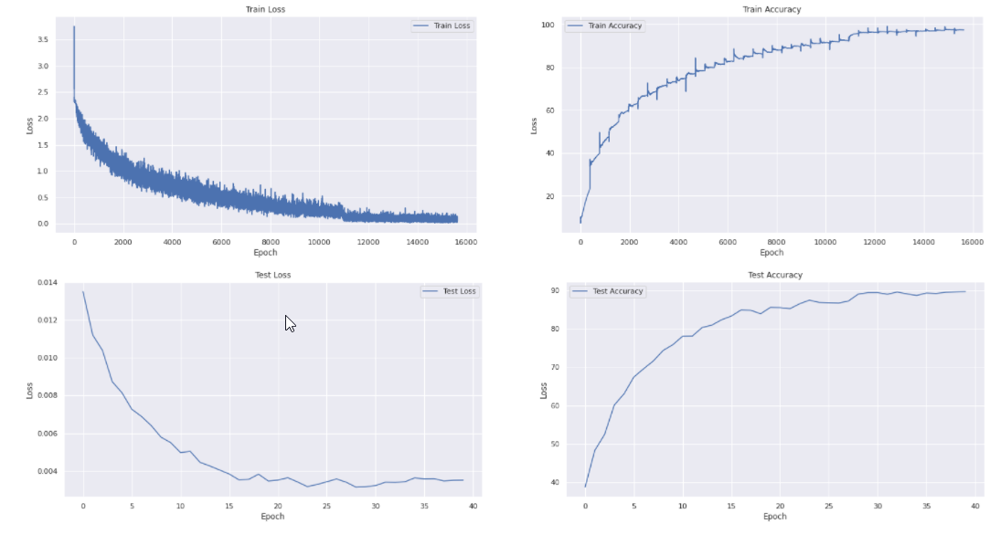
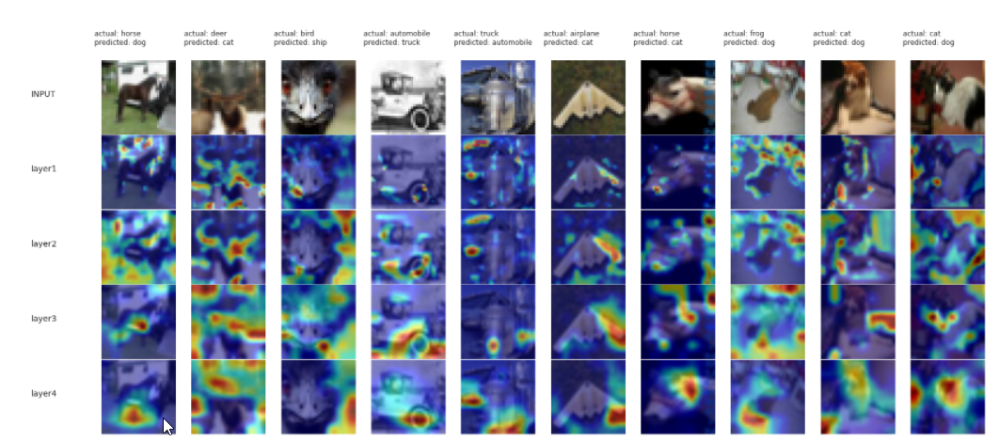
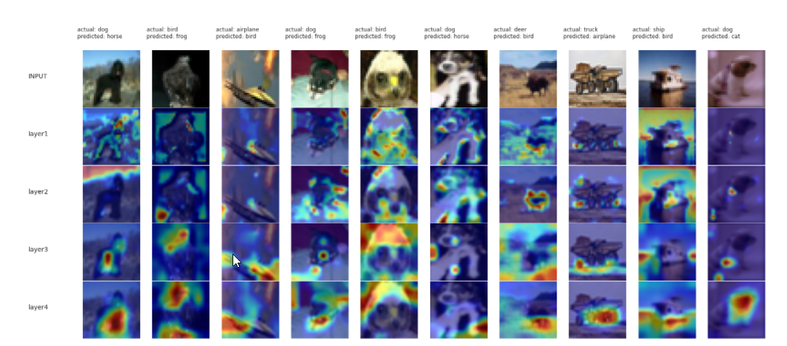

- [1. Session 8 Assignment: Advanced training concepts: Class activation maps, Weight Updates, Optimizers & LR Schedulers, GradCAM, Gradient Descent, Learning Rate](#1-session-8-assignment-advanced-training-concepts-class-activation-maps-weight-updates-optimizers--lr-schedulers-gradcam-gradient-descent-learning-rate)
  - [1.1. Team Members](#11-team-members)
  - [1.2. Problem Statement](#12-problem-statement)
  - [1.3. Common models git reposiotory](#13-common-models-git-reposiotory)
  - [1.4. ResNet model training and visualization Notebook](#14-resnet-model-training-and-visualization-notebook)
    - [1.4.1. Importing code from common model repo into the notebook](#141-importing-code-from-common-model-repo-into-the-notebook)
    - [1.4.2. ResNet Model summary](#142-resnet-model-summary)
    - [1.4.3. Training and Testing logs](#143-training-and-testing-logs)
    - [1.4.4. Misclassified images](#144-misclassified-images)
    - [1.4.5. Plots for Train and Test Loss and Accuracy](#145-plots-for-train-and-test-loss-and-accuracy)
    - [1.4.6. GradCam output for misclassified images](#146-gradcam-output-for-misclassified-images)
# 1. Session 8 Assignment: Advanced training concepts: Class activation maps, Weight Updates, Optimizers & LR Schedulers, GradCAM, Gradient Descent, Learning Rate

## 1.1. Team Members
- Haswanth Aekula
- Raja Rajendran
- Shreeyash Pawar

## 1.2. Problem Statement
Train a ResNet18 model on CIFAR10 dataset for 40 epochs

## 1.3. Common models git reposiotory

- common models git repository: [https://github.com/hassiahk/train-your-model-pytorch](https://github.com/hassiahk/train-your-model-pytorch)

```text
.
├── main.py
├── models
│   ├── __init__.py
│   └── resnet.py
├── README.md
├── requirements.txt
└── utils
    ├── grad_cam.py
    ├── helper.py
    ├── __init__.py
    ├── plot_utils.py
    ├── test.py
    ├── train.py
    └── transforms.py
```

- `main.py`
  - main driver code, responsible for training the model
      ```python
      def trainer(model, epochs, device, train_loader, test_loader, optimizer, criterion, l1_factor, use_scheduler=True):
          """
          Train and evaluate for given epochs.
          """
          train_losses = []
          test_losses = []
          train_accuracy = []
          test_accuracy = []
          lrs = []
          if use_scheduler:
              scheduler = ReduceLROnPlateau(optimizer, factor=0.2, patience=3, verbose=True, mode="max")
          for epoch in range(1, epochs + 1):
              print(f"Epoch {epoch}:")
              train(model, device, train_loader, optimizer, train_accuracy, train_losses, l1_factor, criterion, lrs)
              test(model, device, test_loader, test_accuracy, test_losses, criterion)

              if use_scheduler:
                  scheduler.step(test_accuracy[-1])

          return train_accuracy, train_losses, test_accuracy, test_losses    
      ```
-  `utils/` directory
   - contains the various utilities including `test.py`, `train.py`, `plot_utils.py` and others
-  `models/` directory
   - contains the model definitions such as `resnet.py` (for ResNet)

## 1.4. ResNet model training and visualization Notebook

[https://github.com/hassiahk/EVA6-Phase1-Assignments/blob/main/Session8-Advanced_Training_Concepts/CIFAR10_ResNet18.ipynb](https://github.com/hassiahk/EVA6-Phase1-Assignments/blob/main/Session8-Advanced_Training_Concepts/CIFAR10_ResNet18.ipynb)

- This is the early submission of the assignment specified for late students.  The following are done in this assignment submission
  1. Train for 40 Epochs  (see training output further below)
  2. 20 misclassified images (see further below)
  3. 20 GradCam output on the SAME misclassified images (see further below)
  4. Apply these transforms while training:  ( see [utils/transforms.py](https://github.com/hassiahk/train-your-model-pytorch/blob/main/utils/transforms.py))
     1. RandomCrop(32, padding=4)
     2. CutOut(16x16)
     3. Rotate(±5°)
  5. Must use ReduceLROnPlateau  ( see [main.py](https://github.com/hassiahk/train-your-model-pytorch/blob/main/main.py))
  6. Must use LayerNormalization ONLY ( see [CIFAR10_ResNet18.ipynb](https://github.com/hassiahk/EVA6-Phase1-Assignments/blob/main/Session8-Advanced_Training_Concepts/CIFAR10_ResNet18.ipynb))

### 1.4.1. Importing code from common model repo into the notebook

`git clone` command in the notebook clones the common model and utils code to `/content/train-your-model-pytorch`
```
!git clone https://github.com/hassiahk/train-your-model-pytorch.git

Cloning into 'train-your-model-pytorch'...
remote: Enumerating objects: 45, done.
remote: Counting objects: 100% (45/45), done.
remote: Compressing objects: 100% (30/30), done.
remote: Total 45 (delta 14), reused 40 (delta 12), pack-reused 0
Unpacking objects: 100% (45/45), done.
```

the current working directory of the notebook (using `cd`) is changed to `/content/train-your-model-pytorch` so that the notebook can refer to the model, utils and others using import statements similar to below.  This works because the current working directory `.` is automatically added to `sys.path` ( `PYTHONPATH` )

```python
from utils.helper import seed_everything, get_default_device, calculate_mean_std    # imports from utils/helper.py

.
.
.

from utils.transforms import apply_transforms       # imports from utils/transforms.py
.
.
.
from main import trainer        # imports trainer from main.py
.
.

from utils.train import train     # import train from utilis/train.py; done in main.py
from utils.test import test       # import test from utilis/train.py; done in main.py

```

### 1.4.2. ResNet Model summary

from [https://github.com/hassiahk/EVA6-Phase1-Assignments/blob/main/Session8-Advanced_Training_Concepts/CIFAR10_ResNet18.ipynb](https://github.com/hassiahk/EVA6-Phase1-Assignments/blob/main/Session8-Advanced_Training_Concepts/CIFAR10_ResNet18.ipynb)

```
```text
----------------------------------------------------------------
        Layer (type)               Output Shape         Param #
================================================================
            Conv2d-1           [-1, 64, 32, 32]           1,728
         GroupNorm-2           [-1, 64, 32, 32]             128
            Conv2d-3           [-1, 64, 32, 32]          36,864
         GroupNorm-4           [-1, 64, 32, 32]             128
            Conv2d-5           [-1, 64, 32, 32]          36,864
         GroupNorm-6           [-1, 64, 32, 32]             128
        BasicBlock-7           [-1, 64, 32, 32]               0
            Conv2d-8           [-1, 64, 32, 32]          36,864
         GroupNorm-9           [-1, 64, 32, 32]             128
           Conv2d-10           [-1, 64, 32, 32]          36,864
        GroupNorm-11           [-1, 64, 32, 32]             128
       BasicBlock-12           [-1, 64, 32, 32]               0
           Conv2d-13          [-1, 128, 16, 16]          73,728
        GroupNorm-14          [-1, 128, 16, 16]             256
           Conv2d-15          [-1, 128, 16, 16]         147,456
        GroupNorm-16          [-1, 128, 16, 16]             256
           Conv2d-17          [-1, 128, 16, 16]           8,192
        GroupNorm-18          [-1, 128, 16, 16]             256
       BasicBlock-19          [-1, 128, 16, 16]               0
           Conv2d-20          [-1, 128, 16, 16]         147,456
        GroupNorm-21          [-1, 128, 16, 16]             256
           Conv2d-22          [-1, 128, 16, 16]         147,456
        GroupNorm-23          [-1, 128, 16, 16]             256
       BasicBlock-24          [-1, 128, 16, 16]               0
           Conv2d-25            [-1, 256, 8, 8]         294,912
        GroupNorm-26            [-1, 256, 8, 8]             512
           Conv2d-27            [-1, 256, 8, 8]         589,824
        GroupNorm-28            [-1, 256, 8, 8]             512
           Conv2d-29            [-1, 256, 8, 8]          32,768
        GroupNorm-30            [-1, 256, 8, 8]             512
       BasicBlock-31            [-1, 256, 8, 8]               0
           Conv2d-32            [-1, 256, 8, 8]         589,824
        GroupNorm-33            [-1, 256, 8, 8]             512
           Conv2d-34            [-1, 256, 8, 8]         589,824
        GroupNorm-35            [-1, 256, 8, 8]             512
       BasicBlock-36            [-1, 256, 8, 8]               0
           Conv2d-37            [-1, 512, 8, 8]       1,179,648
        GroupNorm-38            [-1, 512, 8, 8]           1,024
           Conv2d-39            [-1, 512, 8, 8]       2,359,296
        GroupNorm-40            [-1, 512, 8, 8]           1,024
           Conv2d-41            [-1, 512, 8, 8]         131,072
        GroupNorm-42            [-1, 512, 8, 8]           1,024
       BasicBlock-43            [-1, 512, 8, 8]               0
           Conv2d-44            [-1, 512, 8, 8]       2,359,296
        GroupNorm-45            [-1, 512, 8, 8]           1,024
           Conv2d-46            [-1, 512, 8, 8]       2,359,296
        GroupNorm-47            [-1, 512, 8, 8]           1,024
       BasicBlock-48            [-1, 512, 8, 8]               0
           Linear-49                   [-1, 10]           5,130
================================================================
Total params: 11,173,962
Trainable params: 11,173,962
Non-trainable params: 0
----------------------------------------------------------------
Input size (MB): 0.01
Forward/backward pass size (MB): 13.50
Params size (MB): 42.63
Estimated Total Size (MB): 56.14
----------------------------------------------------------------
```

### 1.4.3. Training and Testing logs

from [https://github.com/hassiahk/EVA6-Phase1-Assignments/blob/main/Session8-Advanced_Training_Concepts/CIFAR10_ResNet18.ipynb](https://github.com/hassiahk/EVA6-Phase1-Assignments/blob/main/Session8-Advanced_Training_Concepts/CIFAR10_ResNet18.ipynb)

- Training was done for 40 epochs.

```text
Epoch 1:
Train Loss=1.8026634454727173 Batch_id=390 LR= 0.00100 Train Accuracy= 23.35: 100%|██████████| 391/391 [01:24<00:00,  4.63it/s]
  0%|          | 0/391 [00:00<?, ?it/s]
: Average Test loss: 0.0135, Test Accuracy: 3868/10000 (38.68%)

Epoch 2:
Train Loss=1.419179081916809 Batch_id=390 LR= 0.00100 Train Accuracy= 39.83: 100%|██████████| 391/391 [01:25<00:00,  4.59it/s]
  0%|          | 0/391 [00:00<?, ?it/s]
: Average Test loss: 0.0112, Test Accuracy: 4829/10000 (48.29%)

Epoch 3:
Train Loss=1.3668787479400635 Batch_id=390 LR= 0.00100 Train Accuracy= 47.62: 100%|██████████| 391/391 [01:25<00:00,  4.59it/s]
  0%|          | 0/391 [00:00<?, ?it/s]
: Average Test loss: 0.0104, Test Accuracy: 5243/10000 (52.43%)

Epoch 4:
Train Loss=1.1890308856964111 Batch_id=390 LR= 0.00100 Train Accuracy= 54.58: 100%|██████████| 391/391 [01:25<00:00,  4.59it/s]
  0%|          | 0/391 [00:00<?, ?it/s]
: Average Test loss: 0.0087, Test Accuracy: 6012/10000 (60.12%)

Epoch 5:
Train Loss=1.0986378192901611 Batch_id=390 LR= 0.00100 Train Accuracy= 59.77: 100%|██████████| 391/391 [01:25<00:00,  4.58it/s]
  0%|          | 0/391 [00:00<?, ?it/s]
: Average Test loss: 0.0081, Test Accuracy: 6304/10000 (63.04%)

Epoch 6:
Train Loss=1.0017337799072266 Batch_id=390 LR= 0.00100 Train Accuracy= 63.25: 100%|██████████| 391/391 [01:25<00:00,  4.58it/s]
  0%|          | 0/391 [00:00<?, ?it/s]
: Average Test loss: 0.0073, Test Accuracy: 6741/10000 (67.41%)

Epoch 7:
Train Loss=0.958392322063446 Batch_id=390 LR= 0.00100 Train Accuracy= 67.01: 100%|██████████| 391/391 [01:25<00:00,  4.58it/s]
  0%|          | 0/391 [00:00<?, ?it/s]
: Average Test loss: 0.0069, Test Accuracy: 6956/10000 (69.56%)

Epoch 8:
Train Loss=0.9467018842697144 Batch_id=390 LR= 0.00100 Train Accuracy= 69.01: 100%|██████████| 391/391 [01:25<00:00,  4.59it/s]
  0%|          | 0/391 [00:00<?, ?it/s]
: Average Test loss: 0.0064, Test Accuracy: 7160/10000 (71.60%)

Epoch 9:
Train Loss=0.7926055192947388 Batch_id=390 LR= 0.00100 Train Accuracy= 71.68: 100%|██████████| 391/391 [01:25<00:00,  4.59it/s]
  0%|          | 0/391 [00:00<?, ?it/s]
: Average Test loss: 0.0058, Test Accuracy: 7433/10000 (74.33%)

Epoch 10:
Train Loss=0.8045053482055664 Batch_id=390 LR= 0.00100 Train Accuracy= 73.39: 100%|██████████| 391/391 [01:25<00:00,  4.58it/s]
  0%|          | 0/391 [00:00<?, ?it/s]
: Average Test loss: 0.0055, Test Accuracy: 7584/10000 (75.84%)

Epoch 11:
Train Loss=0.5746155977249146 Batch_id=390 LR= 0.00100 Train Accuracy= 74.86: 100%|██████████| 391/391 [01:25<00:00,  4.59it/s]
  0%|          | 0/391 [00:00<?, ?it/s]
: Average Test loss: 0.0050, Test Accuracy: 7804/10000 (78.04%)

Epoch 12:
Train Loss=0.5101235508918762 Batch_id=390 LR= 0.00100 Train Accuracy= 77.00: 100%|██████████| 391/391 [01:25<00:00,  4.59it/s]
  0%|          | 0/391 [00:00<?, ?it/s]
: Average Test loss: 0.0050, Test Accuracy: 7808/10000 (78.08%)

Epoch 13:
Train Loss=0.6641258001327515 Batch_id=390 LR= 0.00100 Train Accuracy= 78.47: 100%|██████████| 391/391 [01:25<00:00,  4.60it/s]
  0%|          | 0/391 [00:00<?, ?it/s]
: Average Test loss: 0.0045, Test Accuracy: 8031/10000 (80.31%)

Epoch 14:
Train Loss=0.8516451120376587 Batch_id=390 LR= 0.00100 Train Accuracy= 79.93: 100%|██████████| 391/391 [01:24<00:00,  4.60it/s]
  0%|          | 0/391 [00:00<?, ?it/s]
: Average Test loss: 0.0043, Test Accuracy: 8094/10000 (80.94%)

Epoch 15:
Train Loss=0.3986019194126129 Batch_id=390 LR= 0.00100 Train Accuracy= 81.65: 100%|██████████| 391/391 [01:24<00:00,  4.61it/s]
  0%|          | 0/391 [00:00<?, ?it/s]
: Average Test loss: 0.0040, Test Accuracy: 8234/10000 (82.34%)

Epoch 16:
Train Loss=0.33347034454345703 Batch_id=390 LR= 0.00100 Train Accuracy= 82.79: 100%|██████████| 391/391 [01:24<00:00,  4.60it/s]
  0%|          | 0/391 [00:00<?, ?it/s]
: Average Test loss: 0.0038, Test Accuracy: 8331/10000 (83.31%)

Epoch 17:
Train Loss=0.41548699140548706 Batch_id=390 LR= 0.00100 Train Accuracy= 84.14: 100%|██████████| 391/391 [01:24<00:00,  4.61it/s]
  0%|          | 0/391 [00:00<?, ?it/s]
: Average Test loss: 0.0035, Test Accuracy: 8490/10000 (84.90%)

Epoch 18:
Train Loss=0.473477303981781 Batch_id=390 LR= 0.00100 Train Accuracy= 85.09: 100%|██████████| 391/391 [01:24<00:00,  4.61it/s]
  0%|          | 0/391 [00:00<?, ?it/s]
: Average Test loss: 0.0036, Test Accuracy: 8480/10000 (84.80%)

Epoch 19:
Train Loss=0.5099872350692749 Batch_id=390 LR= 0.00100 Train Accuracy= 86.24: 100%|██████████| 391/391 [01:24<00:00,  4.61it/s]
  0%|          | 0/391 [00:00<?, ?it/s]
: Average Test loss: 0.0038, Test Accuracy: 8390/10000 (83.90%)

Epoch 20:
Train Loss=0.39945095777511597 Batch_id=390 LR= 0.00100 Train Accuracy= 87.07: 100%|██████████| 391/391 [01:24<00:00,  4.62it/s]
  0%|          | 0/391 [00:00<?, ?it/s]
: Average Test loss: 0.0035, Test Accuracy: 8556/10000 (85.56%)

Epoch 21:
Train Loss=0.34328970313072205 Batch_id=390 LR= 0.00100 Train Accuracy= 88.06: 100%|██████████| 391/391 [01:24<00:00,  4.61it/s]
  0%|          | 0/391 [00:00<?, ?it/s]
: Average Test loss: 0.0035, Test Accuracy: 8551/10000 (85.51%)

Epoch 22:
Train Loss=0.5458710193634033 Batch_id=390 LR= 0.00100 Train Accuracy= 88.87: 100%|██████████| 391/391 [01:24<00:00,  4.61it/s]
  0%|          | 0/391 [00:00<?, ?it/s]
: Average Test loss: 0.0036, Test Accuracy: 8522/10000 (85.22%)

Epoch 23:
Train Loss=0.311465322971344 Batch_id=390 LR= 0.00100 Train Accuracy= 89.66: 100%|██████████| 391/391 [01:24<00:00,  4.62it/s]
  0%|          | 0/391 [00:00<?, ?it/s]
: Average Test loss: 0.0034, Test Accuracy: 8651/10000 (86.51%)

Epoch 24:
Train Loss=0.3261822462081909 Batch_id=390 LR= 0.00100 Train Accuracy= 89.88: 100%|██████████| 391/391 [01:24<00:00,  4.62it/s]
  0%|          | 0/391 [00:00<?, ?it/s]
: Average Test loss: 0.0032, Test Accuracy: 8745/10000 (87.45%)

Epoch 25:
Train Loss=0.3183717131614685 Batch_id=390 LR= 0.00100 Train Accuracy= 91.06: 100%|██████████| 391/391 [01:24<00:00,  4.62it/s]
  0%|          | 0/391 [00:00<?, ?it/s]
: Average Test loss: 0.0033, Test Accuracy: 8686/10000 (86.86%)

Epoch 26:
Train Loss=0.23380902409553528 Batch_id=390 LR= 0.00100 Train Accuracy= 91.38: 100%|██████████| 391/391 [01:24<00:00,  4.62it/s]
  0%|          | 0/391 [00:00<?, ?it/s]
: Average Test loss: 0.0034, Test Accuracy: 8678/10000 (86.78%)

Epoch 27:
Train Loss=0.23028528690338135 Batch_id=390 LR= 0.00100 Train Accuracy= 91.89: 100%|██████████| 391/391 [01:24<00:00,  4.62it/s]
  0%|          | 0/391 [00:00<?, ?it/s]
: Average Test loss: 0.0036, Test Accuracy: 8669/10000 (86.69%)

Epoch 28:
Train Loss=0.26705169677734375 Batch_id=390 LR= 0.00100 Train Accuracy= 92.45: 100%|██████████| 391/391 [01:24<00:00,  4.63it/s]
  0%|          | 0/391 [00:00<?, ?it/s]
: Average Test loss: 0.0034, Test Accuracy: 8722/10000 (87.22%)

Epoch    28: reducing learning rate of group 0 to 2.0000e-04.
Epoch 29:
Train Loss=0.14128755033016205 Batch_id=390 LR= 0.00020 Train Accuracy= 95.78: 100%|██████████| 391/391 [01:24<00:00,  4.62it/s]
  0%|          | 0/391 [00:00<?, ?it/s]
: Average Test loss: 0.0031, Test Accuracy: 8901/10000 (89.01%)

Epoch 30:
Train Loss=0.09697981178760529 Batch_id=390 LR= 0.00020 Train Accuracy= 96.14: 100%|██████████| 391/391 [01:24<00:00,  4.62it/s]
  0%|          | 0/391 [00:00<?, ?it/s]
: Average Test loss: 0.0032, Test Accuracy: 8941/10000 (89.41%)

Epoch 31:
Train Loss=0.07749295979738235 Batch_id=390 LR= 0.00020 Train Accuracy= 96.25: 100%|██████████| 391/391 [01:24<00:00,  4.62it/s]
  0%|          | 0/391 [00:00<?, ?it/s]
: Average Test loss: 0.0032, Test Accuracy: 8942/10000 (89.42%)

Epoch 32:
Train Loss=0.15043646097183228 Batch_id=390 LR= 0.00020 Train Accuracy= 96.55: 100%|██████████| 391/391 [01:24<00:00,  4.62it/s]
  0%|          | 0/391 [00:00<?, ?it/s]
: Average Test loss: 0.0034, Test Accuracy: 8898/10000 (88.98%)

Epoch 33:
Train Loss=0.09210254997015 Batch_id=390 LR= 0.00020 Train Accuracy= 96.59: 100%|██████████| 391/391 [01:24<00:00,  4.62it/s]
  0%|          | 0/391 [00:00<?, ?it/s]
: Average Test loss: 0.0034, Test Accuracy: 8958/10000 (89.58%)

Epoch 34:
Train Loss=0.06742336601018906 Batch_id=390 LR= 0.00020 Train Accuracy= 96.73: 100%|██████████| 391/391 [01:24<00:00,  4.62it/s]
  0%|          | 0/391 [00:00<?, ?it/s]
: Average Test loss: 0.0034, Test Accuracy: 8908/10000 (89.08%)

Epoch 35:
Train Loss=0.05402161553502083 Batch_id=390 LR= 0.00020 Train Accuracy= 96.97: 100%|██████████| 391/391 [01:24<00:00,  4.62it/s]
  0%|          | 0/391 [00:00<?, ?it/s]
: Average Test loss: 0.0036, Test Accuracy: 8868/10000 (88.68%)

Epoch 36:
Train Loss=0.13997545838356018 Batch_id=390 LR= 0.00020 Train Accuracy= 96.90: 100%|██████████| 391/391 [01:24<00:00,  4.62it/s]
  0%|          | 0/391 [00:00<?, ?it/s]
: Average Test loss: 0.0036, Test Accuracy: 8931/10000 (89.31%)

Epoch 37:
Train Loss=0.15289735794067383 Batch_id=390 LR= 0.00020 Train Accuracy= 97.02: 100%|██████████| 391/391 [01:24<00:00,  4.62it/s]
  0%|          | 0/391 [00:00<?, ?it/s]
: Average Test loss: 0.0036, Test Accuracy: 8919/10000 (89.19%)

Epoch    37: reducing learning rate of group 0 to 4.0000e-05.
Epoch 38:
Train Loss=0.16515468060970306 Batch_id=390 LR= 0.00004 Train Accuracy= 97.25: 100%|██████████| 391/391 [01:24<00:00,  4.62it/s]
  0%|          | 0/391 [00:00<?, ?it/s]
: Average Test loss: 0.0035, Test Accuracy: 8952/10000 (89.52%)

Epoch 39:
Train Loss=0.07641931623220444 Batch_id=390 LR= 0.00004 Train Accuracy= 97.45: 100%|██████████| 391/391 [01:24<00:00,  4.62it/s]
  0%|          | 0/391 [00:00<?, ?it/s]
: Average Test loss: 0.0035, Test Accuracy: 8960/10000 (89.60%)

Epoch 40:
Train Loss=0.13631263375282288 Batch_id=390 LR= 0.00004 Train Accuracy= 97.43: 100%|██████████| 391/391 [01:24<00:00,  4.62it/s]
: Average Test loss: 0.0035, Test Accuracy: 8968/10000 (89.68%)

```

### 1.4.4. Misclassified images

from [https://github.com/hassiahk/EVA6-Phase1-Assignments/blob/main/Session8-Advanced_Training_Concepts/CIFAR10_ResNet18.ipynb](https://github.com/hassiahk/EVA6-Phase1-Assignments/blob/main/Session8-Advanced_Training_Concepts/CIFAR10_ResNet18.ipynb)

  

### 1.4.5. Plots for Train and Test Loss and Accuracy

from [https://github.com/hassiahk/EVA6-Phase1-Assignments/blob/main/Session8-Advanced_Training_Concepts/CIFAR10_ResNet18.ipynb](https://github.com/hassiahk/EVA6-Phase1-Assignments/blob/main/Session8-Advanced_Training_Concepts/CIFAR10_ResNet18.ipynb)

  

### 1.4.6. GradCam output for misclassified images

from [https://github.com/hassiahk/EVA6-Phase1-Assignments/blob/main/Session8-Advanced_Training_Concepts/CIFAR10_ResNet18.ipynb](https://github.com/hassiahk/EVA6-Phase1-Assignments/blob/main/Session8-Advanced_Training_Concepts/CIFAR10_ResNet18.ipynb)

for the misclassified images, can observe that the feature extraction is not covering the entire class but a part of it (for example, an airplane incorrectly predicted as a cat; or a horse incorrectly predicted as a cat)

  

  
