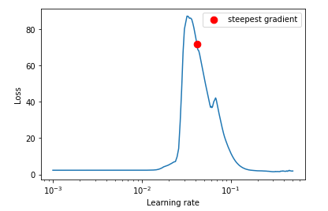
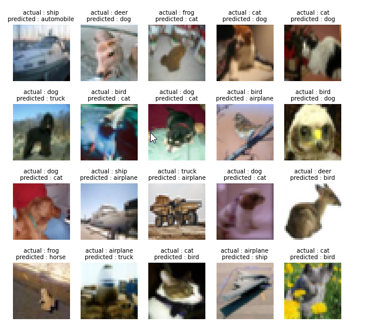
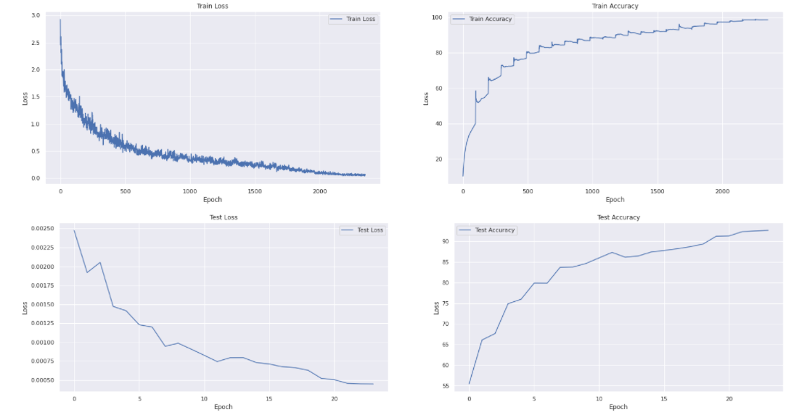
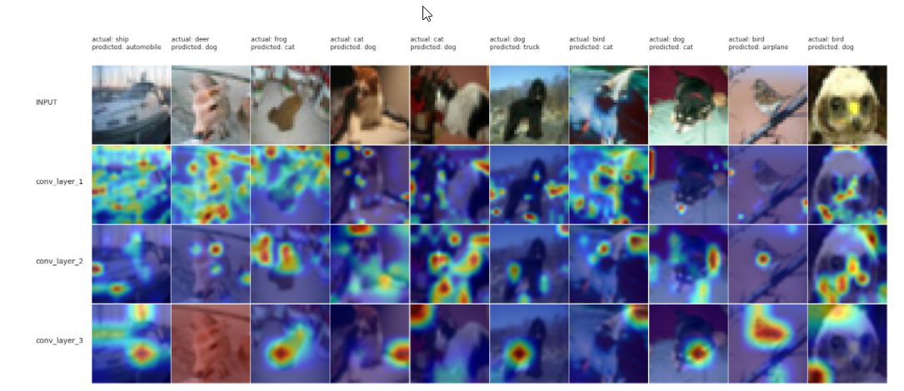

- [1. Session 9 Assignment: LR_Schedulers, ResNets and Higher Receptive Fields](#1-session-9-assignment-lr_schedulers-resnets-and-higher-receptive-fields)
  - [1.1. Team Members](#11-team-members)
  - [1.2. Problem Statement](#12-problem-statement)
  - [1.3. Common models git reposiotory](#13-common-models-git-reposiotory)
  - [1.4. ResNet model training and visualization Notebook](#14-resnet-model-training-and-visualization-notebook)
    - [1.4.1. Importing code from common model repo into the notebook](#141-importing-code-from-common-model-repo-into-the-notebook)
    - [1.4.2. Custom ResNet Model summary](#142-custom-resnet-model-summary)
    - [1.4.3. lr_finder to find maximum LR](#143-lr_finder-to-find-maximum-lr)
    - [1.4.4. Training and Testing logs](#144-training-and-testing-logs)
    - [1.4.5. Misclassified images](#145-misclassified-images)
    - [1.4.6. Plots for Train and Test Loss and Accuracy](#146-plots-for-train-and-test-loss-and-accuracy)
    - [1.4.7. GradCam output for misclassified images](#147-gradcam-output-for-misclassified-images)

# 1. Session 9 Assignment: LR_Schedulers, ResNets and Higher Receptive Fields

## 1.1. Team Members

- Haswanth Aekula
- Raja Rajendran
- Shreeyash Pawar

## 1.2. Problem Statement

1. Write a custom ResNet architecture for CIFAR10 that has the following architecture:
   1. PrepLayer - Conv 3x3 s1, p1) >> BN >> RELU [64k]
   2. Layer1 -
         1. X = Conv 3x3 (s1, p1) >> MaxPool2D >> BN >> RELU [128k]
         2. R1 = ResBlock( (Conv-BN-ReLU-Conv-BN-ReLU))(X) [128k]
         3. Add(X, R1)
   3. Layer 2 -
         1. Conv 3x3 [256k]
         2. MaxPooling2D
         3. BN
         4. ReLU
   4. Layer 3 -
         1. X = Conv 3x3 (s1, p1) >> MaxPool2D >> BN >> RELU [512k]
         2. R2 = ResBlock( (Conv-BN-ReLU-Conv-BN-ReLU))(X) [512k]
         3. Add(X, R2)
   5. MaxPooling with Kernel Size 4
   6. FC Layer
   7. SoftMax
2. Uses One Cycle Policy such that:
       1. Total Epochs = 24
       2. Max at Epoch = 5
       3. LRMIN = FIND   (my note: from group meeting: GitHub - davidtvs/pytorch-lr-finder: A learning rate range test implementation in PyTorch )
       4. LRMAX = FIND  (my note: from group meeting: GitHub - davidtvs/pytorch-lr-finder: A learning rate range test implementation in PyTorch )
       5. NO Annihilation
3. Uses this transform -RandomCrop 32, 32 (after padding of 4) >> FlipLR >> Followed by CutOut(8, 8)
4. Batch size = 512
5. Target Accuracy: 90% (93% for late submission or double scores).

## 1.3. Common models git reposiotory

- common model git repository: [https://github.com/hassiahk/train-your-model-pytorch](https://github.com/hassiahk/train-your-model-pytorch)

```text
.
├── main.py
├── models
│   ├── custom_resnet.py
│   ├── __init__.py
│   └── resnet.py
├── README.md
├── requirements.txt
└── utils
    ├── grad_cam.py
    ├── helper.py
    ├── __init__.py
    ├── plot_utils.py
    ├── test.py
    ├── train.py
    └── transforms.py
```

- `main.py`  
  - main driver code, responsible for training the model
      ```python
      from torch.optim.lr_scheduler import OneCycleLR

      from utils.test import test
      from utils.train import train


      def trainer(model, epochs, device, train_loader, test_loader, optimizer, criterion, l1_factor, max_lr, max_epoch):
          """
          Train and evaluate for given epochs.
          """
          train_losses = []
          test_losses = []
          train_accuracy = []
          test_accuracy = []
          lrs = []

          scheduler = OneCycleLR(
              optimizer,
              max_lr=max_lr,
              epochs=epochs,
              steps_per_epoch=len(train_loader),
              div_factor=8,
              pct_start=max_epoch / epochs,
          )

          for epoch in range(1, epochs + 1):
              print(f"Epoch {epoch}:")
              train(
                  model,
                  device,
                  train_loader,
                  optimizer,
                  train_accuracy,
                  train_losses,
                  l1_factor,
                  criterion,
                  lrs,
                  scheduler,
                  grad_clip=0.1,
              )
              test(model, device, test_loader, test_accuracy, test_losses, criterion)

          return train_accuracy, train_losses, test_accuracy, test_losses
      ```
- `utils/` directory
  - contains the various utilities including `test.py`, `train.py`, `plot_utils.py` and others
- `models/` directory
  - contains the model definition in `custom_resnet.py` 

## 1.4. ResNet model training and visualization Notebook

from [CIFAR10_Custom_ResNet.ipynb](https://github.com/hassiahk/EVA6-Phase1-Assignments/blob/main/Session9-ResNets_Higher_RFs/CIFAR10_Custom_ResNet.ipynb)

- This assignment covers the following
  1. Custom Resnet model [custom_resnet.py](https://github.com/hassiahk/train-your-model-pytorch/blob/main/models/custom_resnet.py)
  2. Train for 24 Epochs  (see training output further below)
  3. 20 misclassified images (see further below)
  4. Apply these transforms while training:  ( see [utils/transforms.py](https://github.com/hassiahk/train-your-model-pytorch/blob/main/utils/transforms.py))
     1. RandomCrop 32, 32 (after padding of 4)
     2. FlipLR
     3. Followed by CutOut(8, 8)
  5. Uses One Cycle Policy   ( see [main.py](https://github.com/hassiahk/train-your-model-pytorch/blob/main/main.py) )  
  6. Use LRFinder ( see see [CIFAR10_Custom_ResNet.ipynb](https://github.com/hassiahk/EVA6-Phase1-Assignments/blob/main/Session9-ResNets_Higher_RFs/CIFAR10_Custom_ResNet.ipynb) )
  7. Must use LayerNormalization ONLY ( see [CIFAR10_Custom_ResNet.ipynb](https://github.com/hassiahk/EVA6-Phase1-Assignments/blob/main/Session9-ResNets_Higher_RFs/CIFAR10_Custom_ResNet.ipynb) )  

### 1.4.1. Importing code from common model repo into the notebook

`git clone` command in the notebook clones the common model and utils code to `/content/train-your-model-pytorch`
```
!git clone https://github.com/hassiahk/train-your-model-pytorch.git

Cloning into 'train-your-model-pytorch'...
remote: Enumerating objects: 45, done.
remote: Counting objects: 100% (45/45), done.
remote: Compressing objects: 100% (30/30), done.
remote: Total 45 (delta 14), reused 40 (delta 12), pack-reused 0
Unpacking objects: 100% (45/45), done.
```

the current working directory of the notebook (using `cd`) is changed to `/content/train-your-model-pytorch` so that the notebook can refer to the model, utils and others using import statements similar to below.  This works because the current working directory `.` is automatically added to `sys.path` ( `PYTHONPATH` )

```python
from utils.helper import seed_everything, get_default_device, calculate_mean_std    # imports from utils/helper.py

.
.
.

from utils.transforms import apply_transforms_custom_resnet       # imports from utils/transforms.py
.
.
.
from main import trainer        # imports trainer from main.py
.
.

from utils.train import train     # done in main.py: import train from utilis/train.py; 
from utils.test import test       # done in main.py: import test from utilis/train.py; 

```

### 1.4.2. Custom ResNet Model summary

from [CIFAR10_Custom_ResNet.ipynb](https://github.com/hassiahk/EVA6-Phase1-Assignments/blob/main/Session9-ResNets_Higher_RFs/CIFAR10_Custom_ResNet.ipynb)

```text
----------------------------------------------------------------
        Layer (type)               Output Shape         Param #
================================================================
            Conv2d-1           [-1, 64, 32, 32]           1,792
              ReLU-2           [-1, 64, 32, 32]               0
       BatchNorm2d-3           [-1, 64, 32, 32]             128
            Conv2d-4          [-1, 128, 32, 32]          73,856
         MaxPool2d-5          [-1, 128, 16, 16]               0
       BatchNorm2d-6          [-1, 128, 16, 16]             256
              ReLU-7          [-1, 128, 16, 16]               0
            Conv2d-8          [-1, 128, 16, 16]         147,456
       BatchNorm2d-9          [-1, 128, 16, 16]             256
           Conv2d-10          [-1, 128, 16, 16]         147,456
      BatchNorm2d-11          [-1, 128, 16, 16]             256
       BasicBlock-12          [-1, 128, 16, 16]               0
           Conv2d-13          [-1, 256, 16, 16]         295,168
        MaxPool2d-14            [-1, 256, 8, 8]               0
      BatchNorm2d-15            [-1, 256, 8, 8]             512
             ReLU-16            [-1, 256, 8, 8]               0
           Conv2d-17            [-1, 512, 8, 8]       1,180,160
        MaxPool2d-18            [-1, 512, 4, 4]               0
      BatchNorm2d-19            [-1, 512, 4, 4]           1,024
             ReLU-20            [-1, 512, 4, 4]               0
           Conv2d-21            [-1, 512, 4, 4]       2,359,296
      BatchNorm2d-22            [-1, 512, 4, 4]           1,024
           Conv2d-23            [-1, 512, 4, 4]       2,359,296
      BatchNorm2d-24            [-1, 512, 4, 4]           1,024
       BasicBlock-25            [-1, 512, 4, 4]               0
        MaxPool2d-26            [-1, 512, 1, 1]               0
           Linear-27                   [-1, 10]           5,130
================================================================
Total params: 6,574,090
Trainable params: 6,574,090
Non-trainable params: 0
----------------------------------------------------------------
Input size (MB): 0.01
Forward/backward pass size (MB): 6.13
Params size (MB): 25.08
Estimated Total Size (MB): 31.22
----------------------------------------------------------------
```

### 1.4.3. lr_finder to find maximum LR

```python
from utils.lr_finder import find_lr

max_lr = find_lr(model, train_loader, test_loader, epochs, optimizer, criterion, device)

HBox(children=(FloatProgress(value=0.0, max=480.0), HTML(value='')))
Learning rate search finished. See the graph with {finder_name}.plot()
LR suggestion: steepest gradient
Suggested LR: 4.16E-02
```

  

### 1.4.4. Training and Testing logs

from [CIFAR10_Custom_ResNet.ipynb](https://github.com/hassiahk/EVA6-Phase1-Assignments/blob/main/Session9-ResNets_Higher_RFs/CIFAR10_Custom_ResNet.ipynb)

- Training was done for `24` epochs.
- Test Accuracy of `92.69%` in the 24th epoch

```text
0%|          | 0/98 [00:00<?, ?it/s]Epoch 1:
Train Loss=1.3631161451339722 Batch_id=97 LR= 0.00870 Train Accuracy= 39.89: 100%|██████████| 98/98 [00:30<00:00,  3.21it/s]
  0%|          | 0/98 [00:00<?, ?it/s]
: Average Test loss: 0.0025, Test Accuracy: 5538/10000 (55.38%)

Epoch 2:
Train Loss=1.013045310974121 Batch_id=97 LR= 0.01783 Train Accuracy= 56.82: 100%|██████████| 98/98 [00:32<00:00,  3.05it/s]
  0%|          | 0/98 [00:00<?, ?it/s]
: Average Test loss: 0.0019, Test Accuracy: 6607/10000 (66.07%)

Epoch 3:
Train Loss=0.7701219916343689 Batch_id=97 LR= 0.02911 Train Accuracy= 67.05: 100%|██████████| 98/98 [00:32<00:00,  3.04it/s]
  0%|          | 0/98 [00:00<?, ?it/s]
: Average Test loss: 0.0021, Test Accuracy: 6763/10000 (67.63%)

Epoch 4:
Train Loss=0.7693478465080261 Batch_id=97 LR= 0.03820 Train Accuracy= 72.62: 100%|██████████| 98/98 [00:31<00:00,  3.07it/s]
  0%|          | 0/98 [00:00<?, ?it/s]
: Average Test loss: 0.0015, Test Accuracy: 7487/10000 (74.87%)

Epoch 5:
Train Loss=0.5452260375022888 Batch_id=97 LR= 0.04163 Train Accuracy= 76.83: 100%|██████████| 98/98 [00:32<00:00,  3.06it/s]
  0%|          | 0/98 [00:00<?, ?it/s]
: Average Test loss: 0.0014, Test Accuracy: 7596/10000 (75.96%)

Epoch 6:
Train Loss=0.447982519865036 Batch_id=97 LR= 0.04134 Train Accuracy= 80.28: 100%|██████████| 98/98 [00:32<00:00,  3.06it/s]
  0%|          | 0/98 [00:00<?, ?it/s]
: Average Test loss: 0.0012, Test Accuracy: 7986/10000 (79.86%)

Epoch 7:
Train Loss=0.4033646881580353 Batch_id=97 LR= 0.04049 Train Accuracy= 82.96: 100%|██████████| 98/98 [00:32<00:00,  3.06it/s]
  0%|          | 0/98 [00:00<?, ?it/s]
: Average Test loss: 0.0012, Test Accuracy: 7984/10000 (79.84%)

Epoch 8:
Train Loss=0.3676537871360779 Batch_id=97 LR= 0.03910 Train Accuracy= 84.36: 100%|██████████| 98/98 [00:32<00:00,  3.06it/s]
  0%|          | 0/98 [00:00<?, ?it/s]
: Average Test loss: 0.0009, Test Accuracy: 8372/10000 (83.72%)

Epoch 9:
Train Loss=0.4020010530948639 Batch_id=97 LR= 0.03722 Train Accuracy= 85.69: 100%|██████████| 98/98 [00:32<00:00,  3.06it/s]
  0%|          | 0/98 [00:00<?, ?it/s]
: Average Test loss: 0.0010, Test Accuracy: 8380/10000 (83.80%)

Epoch 10:
Train Loss=0.40340906381607056 Batch_id=97 LR= 0.03489 Train Accuracy= 86.75: 100%|██████████| 98/98 [00:32<00:00,  3.06it/s]
  0%|          | 0/98 [00:00<?, ?it/s]
: Average Test loss: 0.0009, Test Accuracy: 8467/10000 (84.67%)

Epoch 11:
Train Loss=0.33864933252334595 Batch_id=97 LR= 0.03217 Train Accuracy= 88.12: 100%|██████████| 98/98 [00:31<00:00,  3.06it/s]
  0%|          | 0/98 [00:00<?, ?it/s]
: Average Test loss: 0.0008, Test Accuracy: 8602/10000 (86.02%)

Epoch 12:
Train Loss=0.3688940107822418 Batch_id=97 LR= 0.02914 Train Accuracy= 88.40: 100%|██████████| 98/98 [00:32<00:00,  3.06it/s]
  0%|          | 0/98 [00:00<?, ?it/s]
: Average Test loss: 0.0007, Test Accuracy: 8735/10000 (87.35%)

Epoch 13:
Train Loss=0.32747992873191833 Batch_id=97 LR= 0.02589 Train Accuracy= 89.74: 100%|██████████| 98/98 [00:32<00:00,  3.06it/s]
  0%|          | 0/98 [00:00<?, ?it/s]
: Average Test loss: 0.0008, Test Accuracy: 8619/10000 (86.19%)

Epoch 14:
Train Loss=0.31065699458122253 Batch_id=97 LR= 0.02250 Train Accuracy= 90.40: 100%|██████████| 98/98 [00:31<00:00,  3.06it/s]
  0%|          | 0/98 [00:00<?, ?it/s]
: Average Test loss: 0.0008, Test Accuracy: 8647/10000 (86.47%)

Epoch 15:
Train Loss=0.25632357597351074 Batch_id=97 LR= 0.01906 Train Accuracy= 91.34: 100%|██████████| 98/98 [00:32<00:00,  3.06it/s]
  0%|          | 0/98 [00:00<?, ?it/s]
: Average Test loss: 0.0007, Test Accuracy: 8744/10000 (87.44%)

Epoch 16:
Train Loss=0.2181011140346527 Batch_id=97 LR= 0.01567 Train Accuracy= 91.94: 100%|██████████| 98/98 [00:31<00:00,  3.06it/s]
  0%|          | 0/98 [00:00<?, ?it/s]
: Average Test loss: 0.0007, Test Accuracy: 8781/10000 (87.81%)

Epoch 17:
Train Loss=0.2187138795852661 Batch_id=97 LR= 0.01242 Train Accuracy= 92.78: 100%|██████████| 98/98 [00:32<00:00,  3.06it/s]
  0%|          | 0/98 [00:00<?, ?it/s]
: Average Test loss: 0.0007, Test Accuracy: 8823/10000 (88.23%)

Epoch 18:
Train Loss=0.17687594890594482 Batch_id=97 LR= 0.00940 Train Accuracy= 93.72: 100%|██████████| 98/98 [00:31<00:00,  3.06it/s]
  0%|          | 0/98 [00:00<?, ?it/s]
: Average Test loss: 0.0007, Test Accuracy: 8873/10000 (88.73%)

Epoch 19:
Train Loss=0.17309750616550446 Batch_id=97 LR= 0.00669 Train Accuracy= 95.10: 100%|██████████| 98/98 [00:31<00:00,  3.07it/s]
  0%|          | 0/98 [00:00<?, ?it/s]
: Average Test loss: 0.0006, Test Accuracy: 8939/10000 (89.39%)

Epoch 20:
Train Loss=0.11751209944486618 Batch_id=97 LR= 0.00437 Train Accuracy= 96.18: 100%|██████████| 98/98 [00:31<00:00,  3.06it/s]
  0%|          | 0/98 [00:00<?, ?it/s]
: Average Test loss: 0.0005, Test Accuracy: 9127/10000 (91.27%)

Epoch 21:
Train Loss=0.10728524625301361 Batch_id=97 LR= 0.00249 Train Accuracy= 97.25: 100%|██████████| 98/98 [00:31<00:00,  3.06it/s]
  0%|          | 0/98 [00:00<?, ?it/s]
: Average Test loss: 0.0005, Test Accuracy: 9135/10000 (91.35%)

Epoch 22:
Train Loss=0.05926457419991493 Batch_id=97 LR= 0.00112 Train Accuracy= 97.91: 100%|██████████| 98/98 [00:32<00:00,  3.06it/s]
  0%|          | 0/98 [00:00<?, ?it/s]
: Average Test loss: 0.0005, Test Accuracy: 9239/10000 (92.39%)

Epoch 23:
Train Loss=0.06890365481376648 Batch_id=97 LR= 0.00028 Train Accuracy= 98.50: 100%|██████████| 98/98 [00:31<00:00,  3.06it/s]
  0%|          | 0/98 [00:00<?, ?it/s]
: Average Test loss: 0.0005, Test Accuracy: 9256/10000 (92.56%)

Epoch 24:
Train Loss=0.06850629299879074 Batch_id=97 LR= 0.00000 Train Accuracy= 98.54: 100%|██████████| 98/98 [00:31<00:00,  3.06it/s]

: Average Test loss: 0.0004, Test Accuracy: 9269/10000 (92.69%)

```

### 1.4.5. Misclassified images

from [CIFAR10_Custom_ResNet.ipynb](https://github.com/hassiahk/EVA6-Phase1-Assignments/blob/main/Session9-ResNets_Higher_RFs/CIFAR10_Custom_ResNet.ipynb)

  

### 1.4.6. Plots for Train and Test Loss and Accuracy

from [CIFAR10_Custom_ResNet.ipynb](https://github.com/hassiahk/EVA6-Phase1-Assignments/blob/main/Session9-ResNets_Higher_RFs/CIFAR10_Custom_ResNet.ipynb)

  

### 1.4.7. GradCam output for misclassified images

from [CIFAR10_Custom_ResNet.ipynb](https://github.com/hassiahk/EVA6-Phase1-Assignments/blob/main/Session9-ResNets_Higher_RFs/CIFAR10_Custom_ResNet.ipynb)

  
